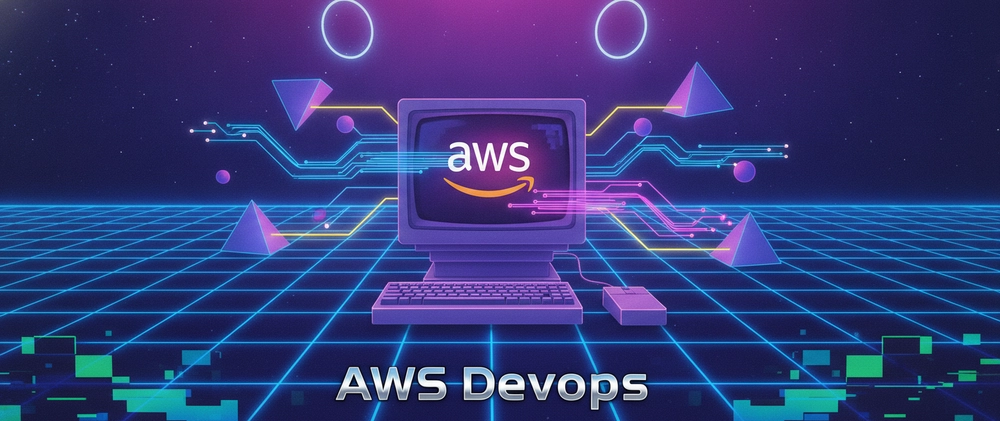

# Day 0 — Starting My AWS & DevOps Daily Blog

I'm an AWS Certified Solutions Architect Associate working professionally in AWS and DevOps. Starting today, I'm committing to writing and publishing content every single day, documenting real problems solved, services explored, and lessons learned along the way.

## Why
- Build a genuine daily learning habit
- Create a searchable, organized reference for myself and others
- Build a visible, consistent body of work in AWS/DevOps

## Where to read & follow
- GitHub: https://github.com/sr-palatasingh/AWS-DevOps-Blog
- Dev.to: https://dev.to/sr-palatasingh/series/42698
- Hashnode: https://sr-palatasingh.hashnode.dev/series/aws-devops-blog
- LinkedIn: https://www.linkedin.com/in/soumyaranjan-palatasingh/

This is Day 0 — the setup and announcement. Day 1 begins tomorrow.
