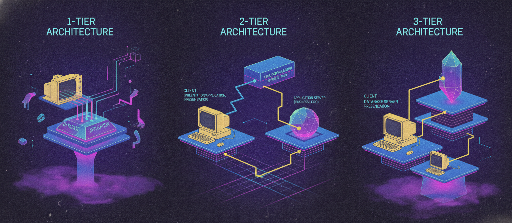
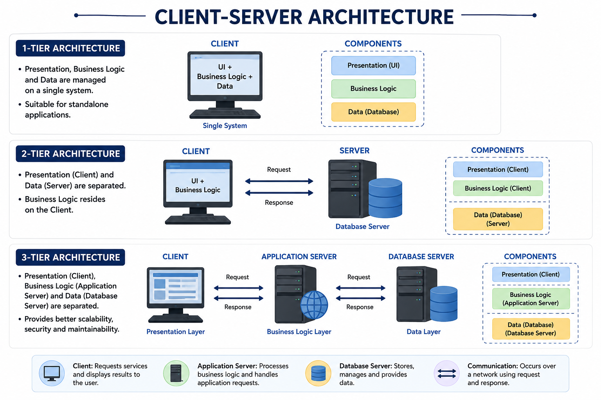

# Day 2: Client-Server Architecture — 1-Tier, 2-Tier, and 3-Tier Explained
Continuing the fundamentals series before we move into AWS. Today: client-server architecture and the tier models that describe how applications are structured.

## What is a Client?

A client is a device or application that requests services or resources from a server. It's the front-end users interact with directly — a web browser, a mobile app, a desktop application. The client sends requests and displays or processes the response it gets back.

Examples: a browser requesting a webpage, a banking app requesting your account balance, Postman sending an API request.

## What is a Server?

A server is a system that provides services, resources, or data to clients on request. It listens for incoming requests, processes them, and sends back a response. Servers are typically more powerful machines built to handle multiple client requests at once.

Examples: a web server hosting a site, a database server storing and retrieving data, an application server running business logic.

## 1-Tier Architecture

Everything — the user interface, business logic, and database — lives on a single machine. There's no separation between client and server.

Use case: simple standalone apps, like a desktop calculator or a local note-taking app.
Pros: simple, fast, easy to build.
Cons: not scalable, no separation of concerns, single point of failure.

## 2-Tier Architecture

The application splits into two layers: client (UI + logic) and server (database). The client talks directly to the database over a network.

Use case: desktop apps connecting straight to a central database, like billing software on each employee's machine.
Pros: simpler than 3-tier, fast for small-scale use.
Cons: business logic on the client makes updates harder, doesn't scale well, tighter coupling increases security risk.

## 3-Tier Architecture

The application splits into three layers: presentation (client), application/business logic (server), and database. The client never talks to the database directly — it goes through the application server.

Use case: most modern web apps — browser (presentation) → backend API (business logic) → database (data storage).
Pros: scalable, easier to maintain, better security, each layer scales independently.
Cons: more complex to design, more communication overhead than 1-tier or 2-tier.

**Quick way to remember it:** 1-tier = everything on one machine, 2-tier = client talks straight to the database, 3-tier = client talks to an app layer, which talks to the database — adding a buffer that makes things scalable and secure.

---

**Coming up on Day 3:** Data centers and virtualization — the foundation everything in cloud computing is built on.
#aws #devops #architecture #learning

## Where to read & follow
- Dev.to: [https://dev.to/sr-palatasingh/series/42698]
- Hashnode: [https://sr-palatasingh.hashnode.dev/series/aws-devops-blog]
- LinkedIn: [https://www.linkedin.com/in/soumyaranjan-palatasingh/]
