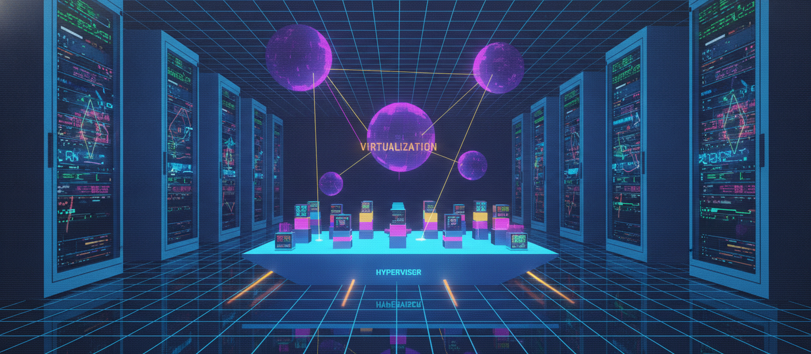
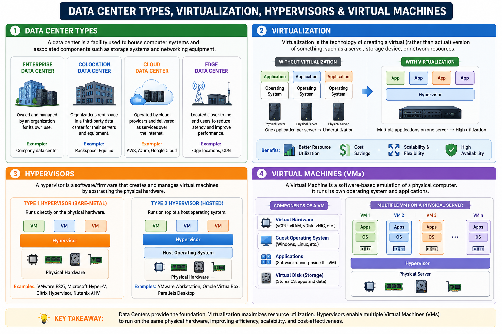

# Day 3: Data Center Types, Virtualization, Hypervisors, and Virtual Machines

We've covered cloud fundamentals (Day 1) and client-server architecture (Day 2). Today: data centers, virtualization, hypervisors, and virtual machines — the layers that make cloud computing physically possible.

## What is a Data Center?

A data center is a facility housing compute, storage, and network resources used to store, process, and manage large amounts of data.

**Types of data centers:**
- **On-premises data center** — owned and operated by a single organization, fully in-house
- **Colocation data center** — an organization rents space, power, and cooling in a third-party facility but brings its own servers/hardware
- **Managed services data center** — a third party manages the infrastructure and operations on the organization's behalf
- **Cloud data center** — owned and operated by cloud providers (AWS, Azure, GCP), offering resources on-demand over the internet, without the organization owning any physical hardware

## What is Virtualization?

Virtualization abstracts physical resources — compute, storage, and network — so they function as logical (virtual) resources instead of physical ones.

For example, in a compute system, virtualization allows a single physical machine to appear as multiple logical machines, each running its own operating system concurrently. This is what makes efficient resource sharing possible — instead of one dedicated physical server per application, many virtual machines can run on the same physical hardware.

## What is a Hypervisor?

A hypervisor is the software layer that creates and manages virtual machines. It sits between the physical hardware and the virtual machines, allocating resources (CPU, memory, storage) from the physical machine to each VM.

**Two types of hypervisors:**
- **Type 1 (bare-metal):** Runs directly on the physical hardware, with no underlying OS. More efficient and commonly used in enterprise/cloud environments. Examples: VMware ESXi, Microsoft Hyper-V, Xen
- **Type 2 (hosted):** Runs on top of an existing operating system, like any other application. Easier to set up, commonly used for personal/testing use. Examples: VMware Workstation, Oracle VirtualBox

## What is a Virtual Machine?

A virtual machine (VM) is a software-based emulation of a physical computer. It runs its own operating system and applications, just like a physical machine, but shares the underlying physical hardware with other VMs — managed by the hypervisor.

Each VM behaves as an independent machine, unaware that it's sharing hardware with others, which is what enables cloud providers to run many customers' workloads securely and efficiently on the same physical infrastructure.

**Putting it together:** A cloud provider's physical servers sit in a data center. A hypervisor runs on that hardware and creates multiple virtual machines. Each VM can run a different OS and workload, isolated from the others — this is the core mechanism behind IaaS.

---

## Where to read & follow
- Dev.to: https://dev.to/sr-palatasingh/series/42698
- Hashnode: https://sr-palatasingh.hashnode.dev/series/aws-devops-blog
- LinkedIn: https://www.linkedin.com/in/soumyaranjan-palatasingh/

**Coming up next:** Some Basic Networking Questions and Answers.
