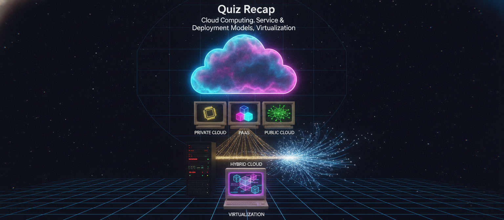
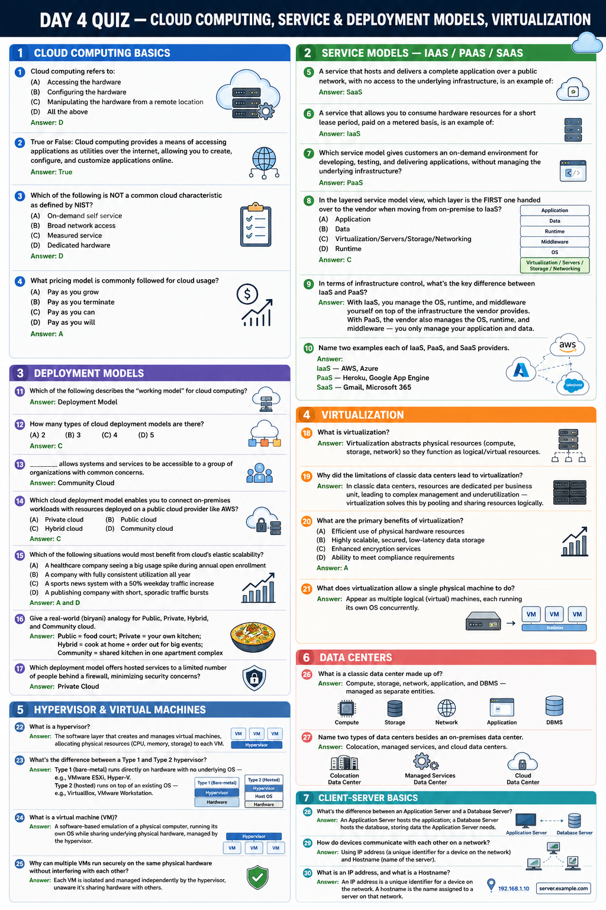

# Day 4: Quiz Recap — Cloud Computing, Service & Deployment Models, Virtualization

Time for a recap. Before we move into networking basics, here's a 30-question quiz covering everything from Day 1 to Day 3 — cloud computing fundamentals, service and deployment models, virtualization, hypervisors, and client-server basics. Test yourself before checking the answers.

## Cloud Computing Basics

1. Cloud computing refers to:
(A) Accessing the hardware (B) Configuring the hardware (C) Manipulating the hardware from a remote location (D) All the above
**Answer: D**

2. True or False: Cloud computing provides a means of accessing applications as utilities over the internet, allowing you to create, configure, and customize applications online.
**Answer: True**

3. Which of the following is NOT a common cloud characteristic as defined by NIST?
(A) On-demand self service (B) Broad network access (C) Measured service (D) Dedicated hardware
**Answer: D**

4. What pricing model is commonly followed for cloud usage?
(A) Pay as you grow (B) Pay as you terminate (C) Pay as you can (D) Pay as you will
**Answer: A**

## Service Models — IaaS / PaaS / SaaS

5. A service that hosts and delivers a complete application over a public network, with no access to the underlying infrastructure, is an example of:
**Answer: SaaS**

6. A service that allows you to consume hardware resources for a short lease period, paid on a metered basis, is an example of:
**Answer: IaaS**

7. Which service model gives customers an on-demand environment for developing, testing, and delivering applications, without managing the underlying infrastructure?
**Answer: PaaS**

8. In the layered service model view, which layer is the FIRST one handed over to the vendor when moving from on-premise to IaaS?
(A) Application (B) Data (C) Virtualization/Servers/Storage/Networking (D) Runtime
**Answer: C**

9. In terms of infrastructure control, what's the key difference between IaaS and PaaS?
**Answer:** With IaaS, you manage the OS, runtime, and middleware yourself on top of the infrastructure the vendor provides. With PaaS, the vendor also manages the OS, runtime, and middleware — you only manage your application and data.

10. Name two examples each of IaaS, PaaS, and SaaS providers.
**Answer:** IaaS — AWS, Azure; PaaS — Heroku, Google App Engine; SaaS — Gmail, Microsoft 365

## Deployment Models

11. Which of the following describes the "working model" for cloud computing?
**Answer: Deployment Model**

12. How many types of cloud deployment models are there?
(A) 2 (B) 3 (C) 4 (D) 5
**Answer: C**

13. _______ allows systems and services to be accessible to a group of organizations with common concerns.
**Answer: Community Cloud**

14. Which cloud deployment model enables you to connect on-premises workloads with resources deployed on a public cloud provider like AWS?
(A) Private cloud (B) Public cloud (C) Hybrid cloud (D) Community cloud
**Answer: C**

15. Which of the following situations would most benefit from cloud's elastic scalability?
(A) A healthcare company seeing a big usage spike during annual open enrollment
(B) A company with fully consistent utilization all year
(C) A sports news system with a 50% weekday traffic increase
(D) A publishing company with short, sporadic traffic bursts
**Answer: A and D**

16. Give a real-world (biryani) analogy for Public, Private, Hybrid, and Community cloud.
**Answer:** Public = food court; Private = your own kitchen; Hybrid = cook at home + order out for big events; Community = shared kitchen in one apartment complex

17. Which deployment model offers hosted services to a limited number of people behind a firewall, minimizing security concerns?
**Answer: Private Cloud**

## Virtualization

18. What is virtualization?
**Answer:** Virtualization abstracts physical resources (compute, storage, network) so they function as logical/virtual resources.

19. Why did the limitations of classic data centers lead to virtualization?
**Answer:** In classic data centers, resources are dedicated per business unit, leading to complex management and underutilization — virtualization solves this by pooling and sharing resources logically.

20. What are the primary benefits of virtualization?
(A) Efficient use of physical hardware resources (B) Highly scalable, secured, low-latency data storage (C) Enhanced encryption services (D) Ability to meet compliance requirements
**Answer: A**

21. What does virtualization allow a single physical machine to do?
**Answer:** Appear as multiple logical (virtual) machines, each running its own OS concurrently.

## Hypervisor & Virtual Machines

22. What is a hypervisor?
**Answer:** The software layer that creates and manages virtual machines, allocating physical resources (CPU, memory, storage) to each VM.

23. What's the difference between a Type 1 and Type 2 hypervisor?
**Answer:** Type 1 (bare-metal) runs directly on hardware with no underlying OS — e.g., VMware ESXi, Hyper-V. Type 2 (hosted) runs on top of an existing OS — e.g., VirtualBox, VMware Workstation.

24. What is a virtual machine (VM)?
**Answer:** A software-based emulation of a physical computer, running its own OS while sharing underlying physical hardware, managed by the hypervisor.

25. Why can multiple VMs run securely on the same physical hardware without interfering with each other?
**Answer:** Each VM is isolated and managed independently by the hypervisor, unaware it's sharing hardware with others.

## Data Centers

26. What is a classic data center made up of?
**Answer:** Compute, storage, network, application, and DBMS — managed as separate entities.

27. Name two types of data centers besides an on-premises data center.
**Answer:** Colocation, managed services, and cloud data centers.

## Client-Server Basics

28. What's the difference between an Application Server and a Database Server?
**Answer:** An Application Server hosts the application; a Database Server hosts the database, storing data the Application Server needs.

29. How do devices communicate with each other on a network?
**Answer:** Using IP address (a unique identifier for a device on the network) and Hostname (name of the server).

30. What is an IP address, and what is a Hostname?
**Answer:** An IP address is a unique identifier for a device on the network. A hostname is the name assigned to a server on that network.

---

**Coming up next:** OSI Model.

---

## Where to read & follow
- Dev.to: https://dev.to/sr-palatasingh/series/42698
- Hashnode: https://sr-palatasingh.hashnode.dev/series/aws-devops-blog
- LinkedIn: https://www.linkedin.com/in/soumyaranjan-palatasingh/
