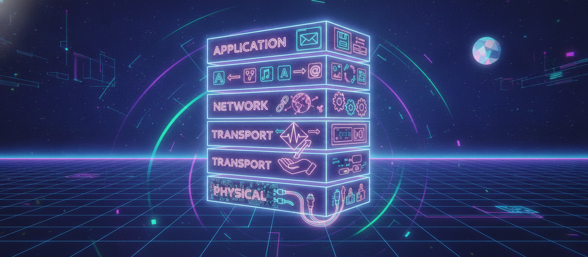
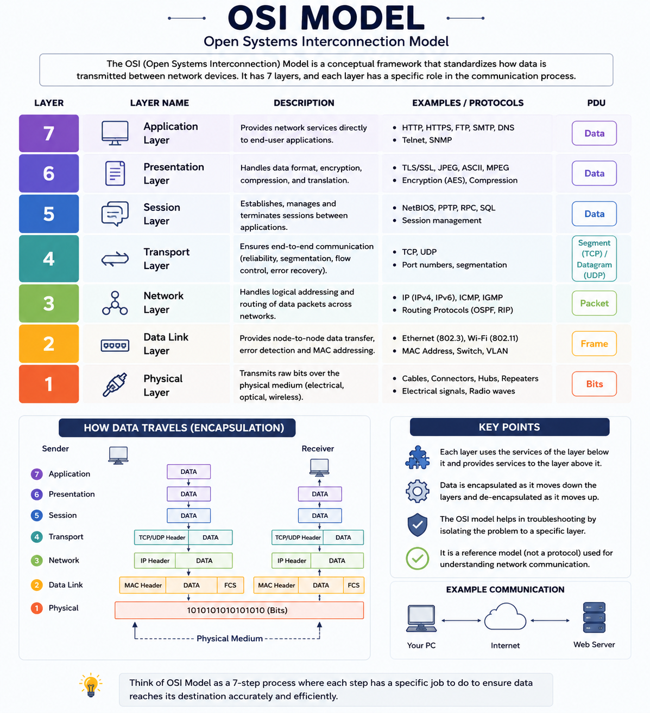

# Day 5: The OSI Model Explained — 7 Layers of Network Communication

Moving into networking fundamentals now. Today: the OSI Model — the framework that explains how data actually travels across a network.

## What is the OSI Model?

The OSI (Open Systems Interconnection) Model is a conceptual framework that standardizes how data communication happens across a network. It breaks the process into 7 layers, each with a specific responsibility, so that different systems and devices can communicate reliably regardless of their underlying hardware or software.

## The 7 Layers (top to bottom)

**7. Application Layer**
The layer closest to the end user — where applications interact with the network. Handles things like email, file transfer, and web browsing.
Examples: HTTP, FTP, SMTP, DNS

**6. Presentation Layer**
Formats and translates data between the application and the network — handles encryption, compression, and data format conversion.
Examples: SSL/TLS encryption, JPEG, ASCII

**5. Session Layer**
Manages sessions/connections between two devices — establishing, maintaining, and terminating communication sessions.
Examples: NetBIOS, RPC

**4. Transport Layer**
Ensures reliable data transfer between devices — handles segmentation, flow control, and error checking. This is where TCP and UDP live.
Examples: TCP (reliable, connection-based), UDP (faster, connectionless)

**3. Network Layer**
Handles logical addressing and routing — determines the best path for data to travel across networks.
Examples: IP, ICMP, routers operate here

**2. Data Link Layer**
Handles physical addressing (MAC addresses) and node-to-node data transfer within the same network — also handles error detection at the frame level.
Examples: Ethernet, switches operate here

**1. Physical Layer**
The actual physical medium — cables, switches, radio frequencies — transmitting raw bits (0s and 1s) over the network.
Examples: Ethernet cables, fiber optics, Wi-Fi signals

## Why the OSI Model Matters

It gives a common reference framework for understanding how data moves from one device to another — useful for troubleshooting (isolating which layer a problem is occurring at), and for understanding how networking protocols and cloud services (like AWS VPCs, security groups, load balancers) actually operate under the hood.

## Easy Way to Remember the Order

A common mnemonic (top to bottom, Layer 7 to Layer 1):
**"All People Seem To Need Data Processing"**
Application → Presentation → Session → Transport → Network → Data Link → Physical

---

## Where to read & follow
- Dev.to: https://dev.to/sr-palatasingh/series/42698
- Hashnode: https://sr-palatasingh.hashnode.dev/series/aws-devops-blog
- LinkedIn: https://www.linkedin.com/in/soumyaranjan-palatasingh/

**Coming up next:** DNS Resolution, Load Balancers, Firewalls & Protocols.
