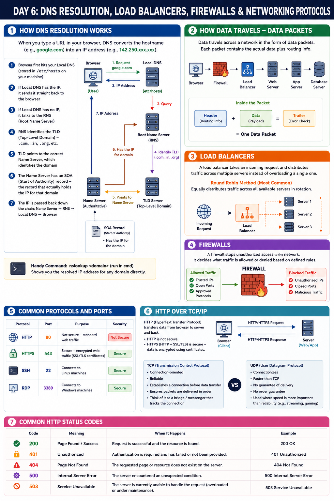

# Day 6: DNS Resolution, Load Balancers, Firewalls & Networking Protocols

Continuing networking fundamentals. Today: how DNS resolution actually works, load balancers, firewalls, and the protocols/ports you'll run into constantly in AWS and DevOps work.

## How DNS Resolution Works

When you type a URL in your browser, two things are needed: a Hostname (e.g., google.com) and an IP Address (e.g., 142.250.xxx.xxx).

DNS (Domain Name Server) stores and remembers IP addresses and hostnames — it keeps track of all hostname-to-IP mappings and converts IP to hostname and hostname to IP.

**Resolution order:**
1. Browser first hits your Local DNS (stored in /etc/host on your machine)
2. If Local DNS has the IP, it sends it straight back to the browser
3. If Local DNS has no IP, it talks to the RNS (Root Name Server)
4. RNS identifies the TLD (Top-Level Domain) — .com, .in, .org, etc.
5. TLD points to the correct Name Server, which identifies the domain
6. The Name Server has an SOA (Start of Authority) record — the record that actually holds the IP for that domain
7. The IP is passed back down the chain: Name Server → RNS → Local DNS → Browser

Handy command: `nslookup <domain>` (run in cmd) — shows you the resolved IP address for any domain directly.

## How Data Travels — Data Packets

Data travels across a network in the form of data packets. Each packet contains the actual data plus routing info.

Simplified request flow: **Browser → Firewall → Load Balancer → Web Server → App Server → Database Server**

## Load Balancers

A load balancer takes an incoming request and distributes traffic across multiple servers, instead of overloading a single one.

Round Robin method — the most common technique — equally distributes traffic across all available servers in rotation.

## Firewalls

A firewall stops unauthorized access to the network. It decides what traffic is allowed or denied based on defined rules.

## Common Protocols and Ports

| Protocol | Port | Purpose |
|---|---|---|
| HTTP | 80 | Not secure — standard web traffic |
| HTTPS | 443 | Secure — encrypted web traffic (SSL/TLS certificates) |
| SSH | 22 | Connects to Linux machines |
| RDP | 3389 | Connects to Windows machines |

## HTTP over TCP/IP

HTTP (HyperText Transfer Protocol) transfers data from browser to server and back. HTTP itself is not secure; HTTPS (HTTP + SSL/TLS) is secure — data is encrypted using certificates.

TCP (Transmission Control Protocol) establishes a reliable connection between two hosts — think of it as a bridge or messenger that tracks the connection.

UDP (User Datagram Protocol) is TCP's faster, connectionless counterpart — but not reliable, since it doesn't guarantee delivery the way TCP does.

## Common HTTP Status Codes

| Code | Meaning |
|---|---|
| 200 | Page Found / Success |
| 401 | Unauthorized |
| 404 | Page Not Found |
| 500 | Internal Server Error |
| 503 | Service Unavailable |

---

## Where to read & follow
- Dev.to: https://dev.to/sr-palatasingh/series/42698
- Hashnode: https://sr-palatasingh.hashnode.dev/series/aws-devops-blog
- LinkedIn: https://www.linkedin.com/in/soumyaranjan-palatasingh/

**Coming up next:** Some networking questions and key concepts — testing everything covered so far.
