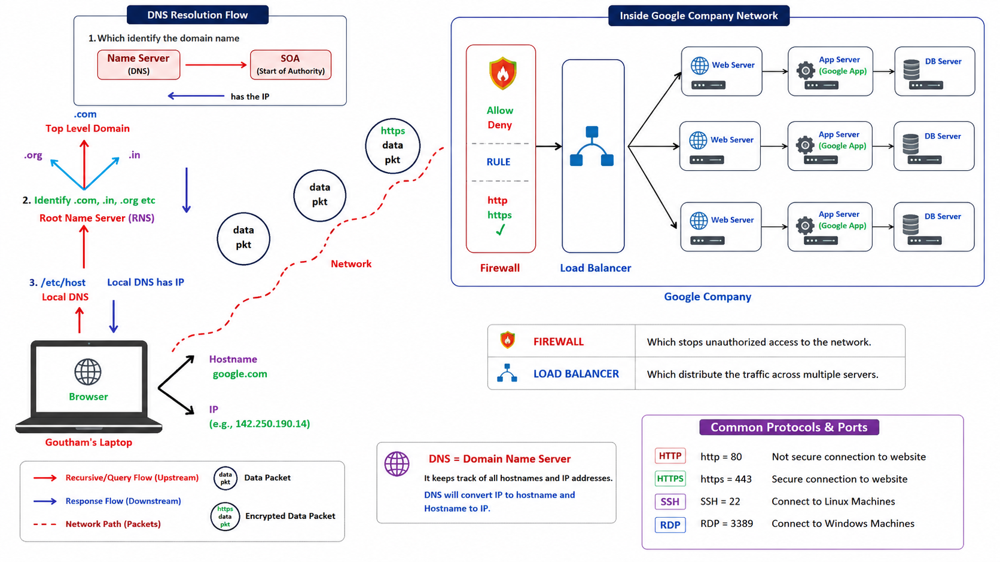
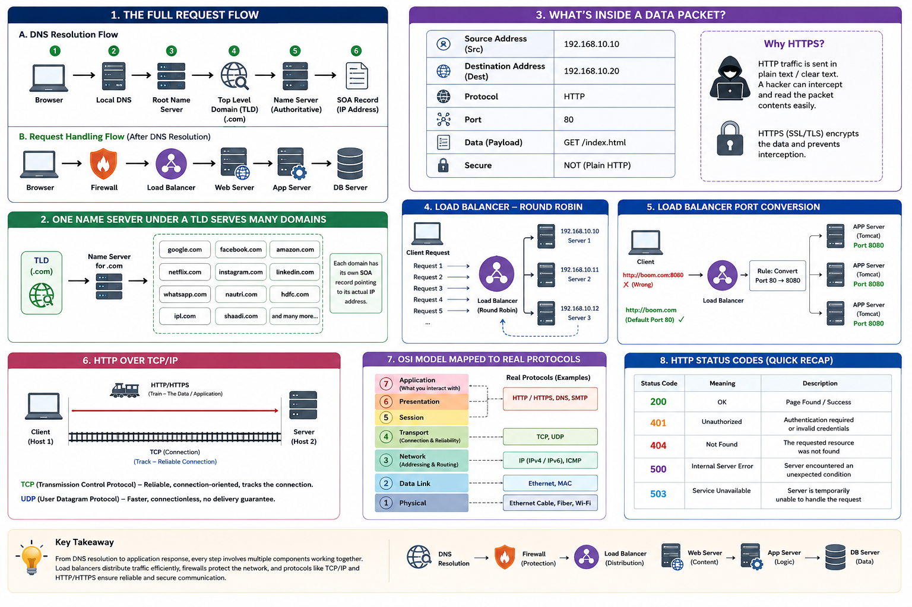

# Day 7: The Complete Request Journey — DNS, Data Packets, Load Balancers & OSI in Action

Yesterday covered DNS resolution, load balancers, and firewalls at a high level. Today: tracing one complete request end-to-end — from typing a URL to the response coming back — with a close look at what's inside a data packet, how load balancers route traffic, and how the OSI model maps to real protocols.

## 1. The Full Request Flow

**A. DNS Resolution Flow**
Browser → Local DNS → Root Name Server → Top Level Domain (.com) → Name Server (Authoritative) → SOA Record (IP Address)

**B. Request Handling Flow (after DNS resolution)**
Browser → Firewall → Load Balancer → Web Server → App Server → DB Server

## 2. One Name Server Under a TLD Serves Many Domains

A single Name Server registered under a TLD (like .com) doesn't just handle one website — it holds records for thousands of domains at once. Google, Facebook, Amazon, Netflix, Instagram, LinkedIn, WhatsApp, and many more all sit under the same .com TLD. Each domain has its own SOA record pointing to its actual IP address.

## 3. What's Inside a Data Packet

Every data packet contains:
- Source Address (Src) — e.g., 192.168.10.10
- Destination Address (Dest) — e.g., 192.168.10.20
- Protocol — e.g., HTTP
- Port — e.g., 80
- Data (Payload) — e.g., GET /index.html
- Secure — NOT, if it's plain HTTP

**Why HTTPS matters:** HTTP traffic is sent in plain text/clear text. A hacker intercepting the network can read the packet's contents easily. HTTPS (SSL/TLS) encrypts the data and prevents interception.

## 4. Load Balancer — Round Robin

A load balancer distributes traffic across multiple servers instead of overloading one. With Round Robin, client requests rotate evenly across available servers:

Request 1 → Server 1 (192.168.10.10)
Request 2 → Server 2 (192.168.10.11)
Request 3 → Server 3 (192.168.10.12)
Request 4 → back to Server 1, and so on.

## 5. Load Balancer Port Conversion

Clients should never need to specify a custom port manually. Trying `http://boom.com:8080` directly fails — that's not the correct way to reach the app.

Instead: the client hits `http://boom.com` on the default port 80. The Load Balancer applies a rule — convert port 80 → port 8080 — and forwards the request to the actual application servers listening on 8080. This is exactly why you never see a port number when browsing google.com — the Load Balancer handles that translation invisibly. A common real-world example: Tomcat application servers default to port 8080.

## 6. HTTP over TCP/IP

TCP (Connection) is the track — it establishes and tracks a reliable connection between two hosts. HTTP/HTTPS is the train — the actual data/application riding on top of that connection.

- **TCP (Transmission Control Protocol):** reliable, connection-oriented, tracks the connection
- **UDP (User Datagram Protocol):** faster, connectionless, no delivery guarantee

## 7. OSI Model Mapped to Real Protocols

The 7 OSI layers map directly to protocols you use daily:

| Layer | Real Protocol Examples |
|---|---|
| 7. Application (what you interact with) | HTTP/HTTPS, DNS, SMTP |
| 6. Presentation | — |
| 5. Session | — |
| 4. Transport (connection & reliability) | TCP, UDP |
| 3. Network (addressing & routing) | IP (IPv4/IPv6), ICMP |
| 2. Data Link | Ethernet, MAC |
| 1. Physical | Ethernet Cable, Fiber, Wi-Fi |

## 8. HTTP Status Codes (Quick Recap)

| Code | Meaning | Description |
|---|---|---|
| 200 | OK | Page found / success |
| 401 | Unauthorized | Authentication required or invalid credentials |
| 404 | Not Found | The requested resource was not found |
| 500 | Internal Server Error | Server encountered an unexpected condition |
| 503 | Service Unavailable | Server is temporarily unable to handle the request |

## Key Takeaway

From DNS resolution to application response, every step involves multiple components working together. Load balancers distribute traffic efficiently, firewalls protect the network, and protocols like TCP/IP and HTTP/HTTPS ensure reliable and secure communication.

DNS Resolution → Firewall (Protection) → Load Balancer (Distribution) → Web Server (Content) → App Server (Logic) → DB Server (Data)

---

## Where to read & follow
- Dev.to: https://dev.to/sr-palatasingh/series/42698
- Hashnode: https://sr-palatasingh.hashnode.dev/series/aws-devops-blog
- LinkedIn: https://www.linkedin.com/in/soumyaranjan-palatasingh/

**Coming up next:** Some networking questions and key concepts — testing everything covered so far.
