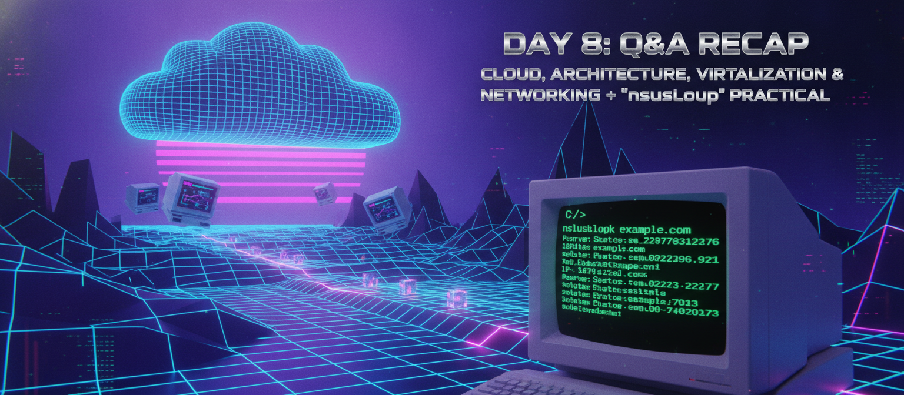
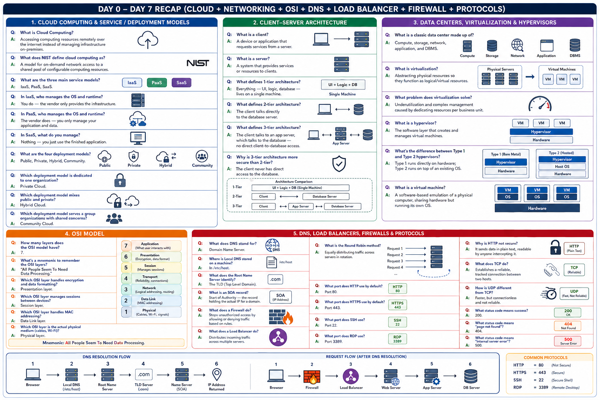
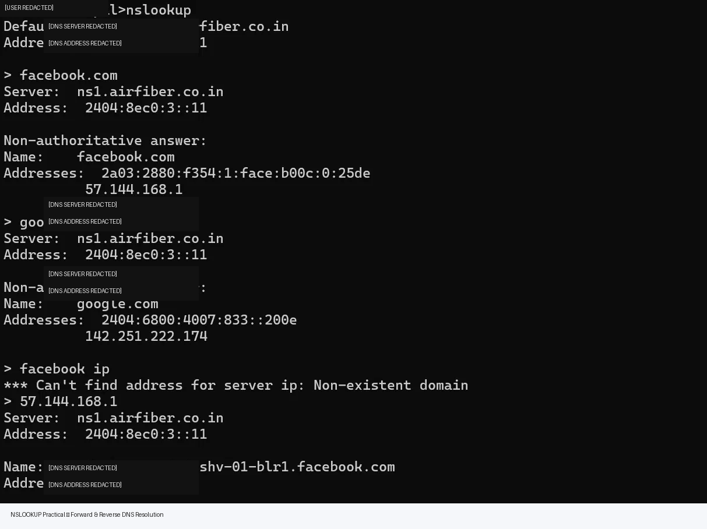

# Day 8: Complete Q&A Recap — Cloud, Architecture, Virtualization & Networking + 'nslookup' Command Practical

Recap day. Testing everything from Day 0 through Day 7 with quick single-line answers, plus a hands-on nslookup practical to try yourself.

## Cloud Computing & Service/Deployment Models

**Q: What is Cloud Computing?**
A: Accessing computing resources remotely over the internet instead of managing infrastructure on-premises.

**Q: What does NIST define cloud computing as?**
A: A model for on-demand network access to a shared pool of configurable computing resources.

**Q: What are the three main service models?**
A: IaaS, PaaS, SaaS.

**Q: In IaaS, who manages the OS and runtime?**
A: You do — the vendor only provides the infrastructure.

**Q: In PaaS, who manages the OS and runtime?**
A: The vendor does — you only manage your application and data.

**Q: In SaaS, what do you manage?**
A: Nothing — you just use the finished application.

**Q: What are the four deployment models?**
A: Public, Private, Hybrid, Community.

**Q: Which deployment model is dedicated to one organization?**
A: Private Cloud.

**Q: Which deployment model mixes public and private?**
A: Hybrid Cloud.

**Q: Which deployment model serves a group of organizations with shared concerns?**
A: Community Cloud.

## Client-Server Architecture

**Q: What is a client?**
A: A device or application that requests services from a server.

**Q: What is a server?**
A: A system that provides services or resources to clients.

**Q: What defines 1-tier architecture?**
A: Everything — UI, logic, database — lives on a single machine.

**Q: What defines 2-tier architecture?**
A: The client talks directly to the database server.

**Q: What defines 3-tier architecture?**
A: The client talks to an app server, which talks to the database — no direct client-to-database access.

**Q: Why is 3-tier architecture more secure than 2-tier?**
A: The client never has direct access to the database.

## Data Centers, Virtualization & Hypervisors

**Q: What is a classic data center made up of?**
A: Compute, storage, network, application, and DBMS.

**Q: What is virtualization?**
A: Abstracting physical resources so they function as logical/virtual resources.

**Q: What problem does virtualization solve?**
A: Underutilization and complex management caused by dedicating resources per business unit.

**Q: What is a hypervisor?**
A: The software layer that creates and manages virtual machines.

**Q: What's the difference between Type 1 and Type 2 hypervisors?**
A: Type 1 runs directly on hardware; Type 2 runs on top of an existing OS.

**Q: What is a virtual machine?**
A: A software-based emulation of a physical computer, sharing hardware but running its own OS.

## OSI Model

**Q: How many layers does the OSI model have?**
A: 7.

**Q: What's a mnemonic to remember the OSI layers?**
A: "All People Seem To Need Data Processing."

**Q: Which OSI layer handles encryption and data formatting?**
A: Presentation layer.

**Q: Which OSI layer manages sessions between devices?**
A: Session layer.

**Q: Which OSI layer handles MAC addressing?**
A: Data Link layer.

**Q: Which OSI layer is the actual physical medium (cables, Wi-Fi)?**
A: Physical layer.

## DNS, Load Balancers, Firewalls & Protocols

**Q: What does DNS stand for?**
A: Domain Name Server.

**Q: Where is Local DNS stored on a machine?**
A: In /etc/host.

**Q: What does the Root Name Server identify?**
A: The TLD (Top Level Domain).

**Q: What is an SOA record?**
A: Start of Authority — the record holding the actual IP for a domain.

**Q: What does a Firewall do?**
A: Stops unauthorized access by allowing or denying traffic based on rules.

**Q: What does a Load Balancer do?**
A: Distributes incoming traffic across multiple servers.

**Q: What is the Round Robin method?**
A: Equally distributing traffic across servers in rotation.

**Q: What port does HTTP use by default?**
A: Port 80.

**Q: What port does HTTPS use by default?**
A: Port 443.

**Q: What port does SSH use?**
A: Port 22.

**Q: What port does RDP use?**
A: Port 3389.

**Q: Why is HTTP not secure?**
A: It sends data in plain text, readable by anyone intercepting it.

**Q: What does TCP do?**
A: Establishes a reliable, tracked connection between two hosts.

**Q: How is UDP different from TCP?**
A: Faster, but connectionless and not reliable.

**Q: What status code means success?**
A: 200.

**Q: What status code means "page not found"?**
A: 404.

**Q: What status code means "internal server error"?**
A: 500.

## nslookup Command Practical

`nslookup` is a command-line tool that resolves a domain name to its IP address — a hands-on way to see DNS resolution actually happen.

**Try it yourself:**
1. Open Command Prompt
2. Type `nslookup`
3. Enter any domain (e.g., facebook.com, google.com) to see its resolved IP
4. Try entering an IP address directly to see the reverse — it'll return the hostname behind that IP

*(Screenshot of my own nslookup practical run attached below as proof.)*

---

## Where to read & follow
- Dev.to: https://dev.to/sr-palatasingh/series/42698
- Hashnode: https://sr-palatasingh.hashnode.dev/series/aws-devops-blog
- LinkedIn: https://www.linkedin.com/in/soumyaranjan-palatasingh/

**Coming up next:** Moving into AWS.
