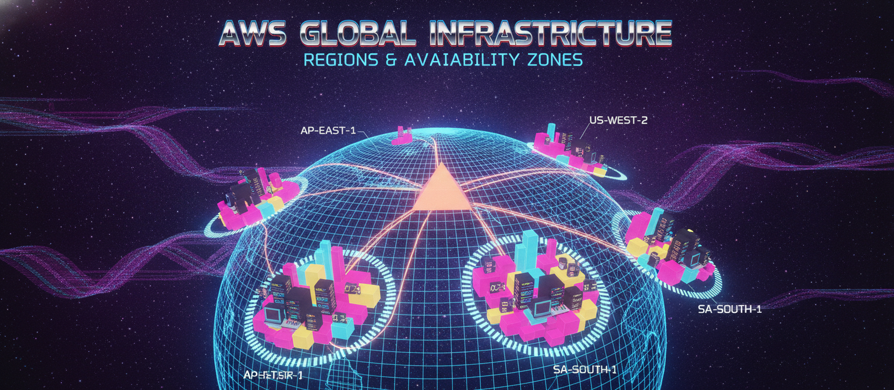
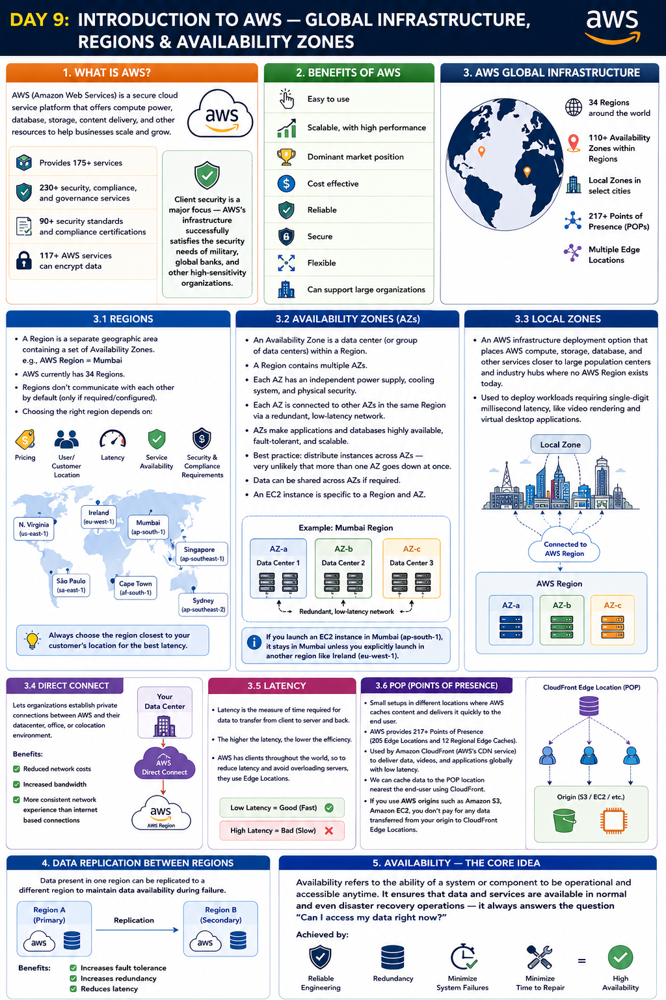

# Day 9: Introduction to AWS — Global Infrastructure, Regions & Availability Zones

Moving into AWS now. Today: what AWS actually is, and how its global infrastructure — Regions, Availability Zones, and Local Zones — is structured.

## What is AWS?

AWS (Amazon Web Services) is a secure cloud service platform that offers compute power, database, storage, content delivery, and other resources to help businesses scale and grow.

- Provides 175+ services
- Client security is a major focus — AWS's infrastructure successfully satisfies the security needs of military, global banks, and other high-sensitivity organizations
- Has 230+ security, compliance, and governance services, with 90+ security standards and compliance certifications, and 117+ AWS services can encrypt data

## Benefits of AWS

- Easy to use
- Scalable, with high performance
- Dominant market position
- Cost effective
- Reliable
- Secure
- Flexible
- Can support large organizations

## AWS Global Infrastructure

**Regions**
- A Region is a separate geographic area containing a set of Availability Zones — e.g., AWS Region = Mumbai
- AWS currently has 34 Regions
- Regions don't communicate with each other by default (only if required/configured)
- Choosing the right region depends on: pricing, user/customer location, latency, service availability, and security/compliance requirements

**Availability Zones (AZs)**
- An Availability Zone is a data center (or group of data centers) within a Region
- A Region contains multiple AZs
- Each AZ has an independent power supply, cooling system, and physical security
- Each AZ is connected to other AZs in the same Region via a redundant, low-latency network
- AZs make applications and databases highly available, fault-tolerant, and scalable compared to traditional data centers
- Best practice: distribute instances across AZs — very unlikely that more than one AZ goes down at once
- Data can be shared across AZs if required
- An EC2 instance is specific to a Region and AZ — e.g., if you launch an EC2 instance in Mumbai, it stays in Mumbai unless you explicitly launch in another region like Ireland

**Local Zones**
- An AWS infrastructure deployment option that places AWS compute, storage, database, and other services closer to large population centers and industry hubs where no AWS Region exists today
- Used to deploy workloads requiring single-digit millisecond latency, like video rendering and virtual desktop applications

**Direct Connect**
- Lets organizations establish private connections between AWS and their datacenter, office, or colocation environment
- Results in reduced network costs, increased bandwidth, and a more consistent network experience than internet-based connections

**Latency**
- Latency is the measure of time required for data to transfer from client to server and back
- The higher the latency, the lower the efficiency
- AWS has clients throughout the world, so to reduce latency and avoid overloading servers, they use Edge Locations
- Low latency = good (fast); High latency = bad (slow)
- Always choose the region closest to your customer's location for the best latency

**POP (Points of Presence) Locations**
- Small setups in different locations where AWS caches content and delivers it quickly to the end user
- As of a recent count, AWS provides 217+ Points of Presence (205 Edge Locations and 12 Regional Edge Caches)
- POP locations are used by Amazon CloudFront (AWS's CDN service) — a fast content delivery network that securely delivers data, videos, and applications to customers globally with low latency
- We can cache data to the POP location nearest the end-user using CloudFront
- If you use AWS origins such as Amazon S3, Amazon EC2, you don't pay for any data transferred from your origin to CloudFront Edge Locations

## Data Replication Between Regions

Data present in one region can be replicated to a different region to maintain data availability during failure.

**Benefits of data replication:**
- Increases fault tolerance
- Increases redundancy
- Reduces latency

## Availability — the Core Idea

Availability refers to the ability of a system or component to be operational and accessible anytime. It ensures that data and services are available in normal and even disaster recovery operations — it always answers the question "Can I access my data right now?" This is achieved by maintaining reliable engineering, redundancy, and management techniques that minimize system failures and time to repair.

---

## Where to read & follow
- Dev.to: https://dev.to/sr-palatasingh/series/42698
- Hashnode: https://sr-palatasingh.hashnode.dev/series/aws-devops-blog
- LinkedIn: https://www.linkedin.com/in/soumyaranjan-palatasingh/

**Coming up next:** Elasticity, Scalability, and High Availability — AWS's three core value props.
