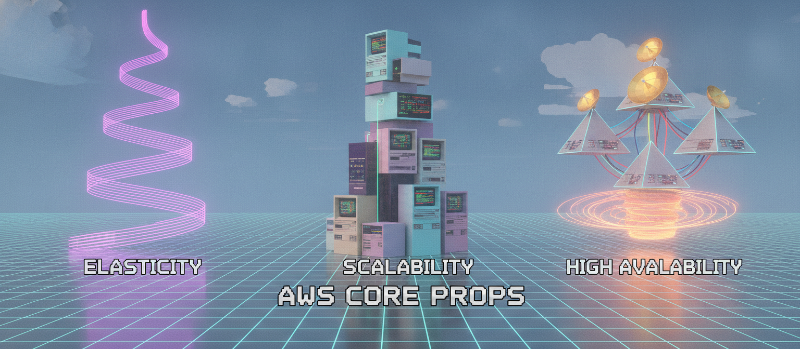
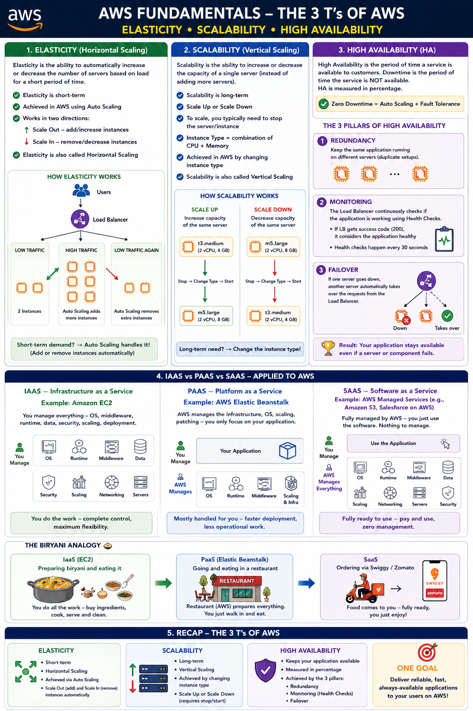

# Day 10: Elasticity, Scalability & High Availability — AWS's 3 Core Value Props

Continuing AWS fundamentals. Today: the 3 T's of AWS — Elasticity, Scalability, and High Availability — what they actually mean and how they're achieved.

## Elasticity

EC2 (Elastic Compute Cloud) is where applications run — instances behind a Load Balancer that distributes traffic to them.

If the Load Balancer starts seeing more traffic, more EC2 instances are launched to handle the load. The increasing and decreasing of the number of servers based on load is called **Elasticity**.

- Elasticity is short-term
- Elasticity is achieved in AWS using **Auto Scaling**
- Auto Scaling works in two directions:
  - **Scale out** — increasing/adding instances
  - **Scale in** — decreasing/removing instances
- Elasticity is also called **Horizontal Scaling**

## Scalability

Increasing the capacity of a single server (instead of adding more servers) is called **Scalability**.

- Example: a database server running 100 databases sized 10TB on an 8GB RAM machine needs its RAM increased due to slowness — that's scaling the existing server up
- Scalability = Scale Up and Scale Down
- To scale, you typically need to stop the server/instance
- Instance Type = combination of CPU + Memory
- Scalability can be achieved in AWS by changing the instance type
- Scalability is long-term
- Scalability is also called **Vertical Scaling**

## High Availability (HA)

- The period of time a service is available to customers is called **High Availability**
- The period of time a service is NOT available to customers is called **Downtime**
- High Availability is measured in percentage
- Zero Downtime = Auto Scaling + Fault Tolerance

**The three pillars of High Availability:**

1. **Redundancy** — keeping the same application running on different servers (duplicate setups)
2. **Monitoring** — the Load Balancer continuously checks if the application is working, using health checks
   - If the Load Balancer gets a success code (200), it considers the application healthy
   - Health checks happen every 30 seconds
3. **Failover** — if one server goes down, another server takes over the requests from the Load Balancer

## IaaS vs PaaS vs SaaS — Applied to AWS

AWS also offers PaaS and SaaS, not just IaaS:

- **AWS Elastic Beanstalk** uses PaaS — you only upload your application, and it takes care of the rest (infrastructure, scaling, deployment)
- With **EC2**, you have to do all of this manually (that's IaaS)
- Elastic Beanstalk enables easy and quick deployment of applications in AWS

**The biryani analogy, applied to AWS:**
- Preparing biryani and eating it = IaaS (EC2 — you do the work)
- Going and eating in a restaurant = PaaS (Elastic Beanstalk — mostly handled for you)
- Ordering via Swiggy/Zomato = SaaS (fully managed, ready to use)

## Recap: The 3 T's of AWS
- **Elasticity** — short-term, horizontal scaling, achieved via Auto Scaling
- **Scalability** — long-term, vertical scaling, achieved by changing instance type
- **High Availability** — achieved via Redundancy + Monitoring + Failover

---

## Where to read & follow
- Dev.to: https://dev.to/sr-palatasingh/series/42698
- Hashnode: https://sr-palatasingh.hashnode.dev/series/aws-devops-blog
- LinkedIn: https://www.linkedin.com/in/soumyaranjan-palatasingh/

**Coming up next:** AWS Service Categories, plus how to access AWS — CLI, SDKs, and the Management Console.
