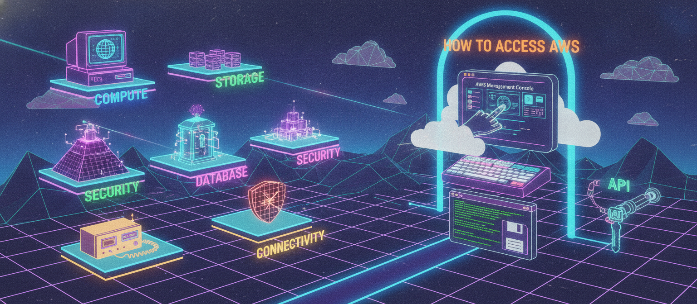
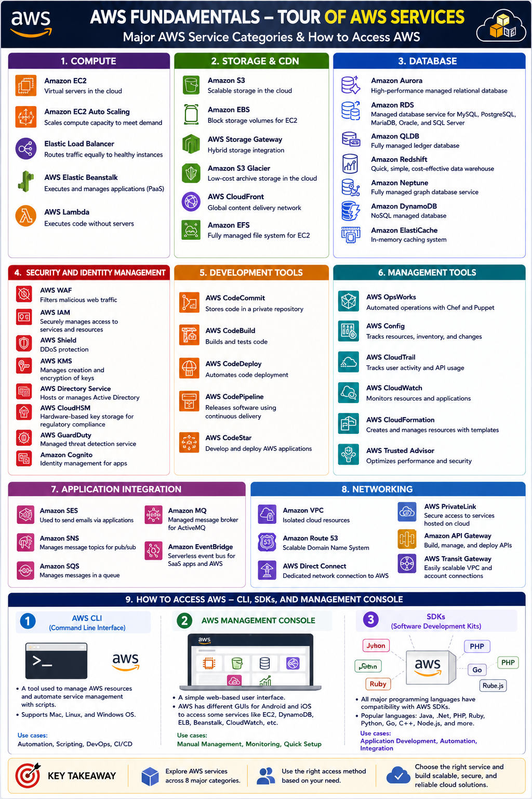

# Day 11: AWS Service Categories — Compute, Storage, Database, Security & How to Access AWS

Wrapping up AWS fundamentals. Today: a tour of AWS's major service categories, and the three ways you can actually access and manage AWS resources.

## Compute

- **Amazon EC2** — virtual servers in the cloud
- **Amazon EC2 Auto Scaling** — scales compute capacity to meet demand
- **Elastic Load Balancer** — routes traffic equally to healthy instances
- **AWS Elastic Beanstalk** — executes and manages applications (PaaS)
- **AWS Lambda** — executes code without servers

## Storage & CDN

- **Amazon S3** — scalable storage in the cloud
- **Amazon EBS** — block storage volumes for EC2
- **AWS Storage Gateway** — hybrid storage integration
- **Amazon S3 Glacier** — low-cost archive storage in the cloud
- **AWS CloudFront** — global content delivery network
- **Amazon EFS** — fully managed file system for EC2

## Database

- **Amazon Aurora** — high-performance managed relational database
- **Amazon RDS** — managed database service for MySQL, PostgreSQL, MariaDB, Oracle, and SQL Server
- **Amazon QLDB** — fully managed ledger database
- **Amazon Redshift** — quick, simple, cost-effective data warehouse
- **Amazon Neptune** — fully managed graph database service
- **Amazon DynamoDB** — NoSQL managed database
- **Amazon ElastiCache** — in-memory caching system

## Security and Identity Management

- **AWS WAF** — filters malicious web traffic
- **AWS IAM** — securely manages access to services and resources
- **AWS Shield** — DDoS protection
- **AWS KMS** — manages creation and encryption of keys
- **AWS Directory Service** — hosts or manages Active Directory
- **AWS CloudHSM** — hardware-based key storage for regulatory compliance
- **AWS GuardDuty** — managed threat detection service
- **Amazon Cognito** — identity management for apps

## Development Tools

- **AWS CodeCommit** — stores code in a private repository
- **AWS CodeBuild** — builds and tests code
- **AWS CodeDeploy** — automates code deployment
- **AWS CodePipeline** — releases software using continuous delivery
- **AWS CodeStar** — develop and deploy AWS applications

## Management Tools

- **AWS OpsWorks** — automated operations with Chef and Puppet
- **AWS Config** — tracks resources, inventory, and changes
- **AWS CloudTrail** — tracks user activity and API usage
- **AWS CloudWatch** — monitors resources and applications
- **AWS CloudFormation** — creates and manages resources with templates
- **AWS Trusted Advisor** — optimizes performance and security

## Application Integration

- **Amazon SES** — used to send emails via applications
- **Amazon SNS** — manages message topics for pub/sub
- **Amazon SQS** — manages messages in a queue
- **Amazon MQ** — managed message broker for ActiveMQ
- **Amazon EventBridge** — serverless event bus for SaaS apps and AWS

## Networking

- **Amazon VPC** — isolated cloud resources
- **Amazon Route 53** — scalable Domain Name System
- **AWS Direct Connect** — dedicated network connection to AWS
- **AWS PrivateLink** — secure access to services hosted on cloud
- **Amazon API Gateway** — build, manage, and deploy APIs
- **AWS Transit Gateway** — easily scalable VPC and account connections

## How to Access AWS — CLI, SDKs, and Management Console

There are three main ways to access AWS resources:

**1. AWS CLI (Command Line Interface)**
- A tool used to manage AWS resources and automate service management with scripts
- Supports Mac, Linux, and Windows OS

**2. AWS Management Console**
- A simple web-based user interface
- AWS has different GUIs for Android and iOS to access some services like EC2, DynamoDB, ELB, Beanstalk, CloudWatch, etc.

**3. SDKs (Software Development Kits)**
- All major programming languages have compatibility with AWS SDKs, including Java, .Net, PHP, Ruby, Python, Go, C++, Node.js, etc.

---

## Where to read & follow
- Dev.to: https://dev.to/sr-palatasingh/series/42698
- Hashnode: https://sr-palatasingh.hashnode.dev/series/aws-devops-blog
- LinkedIn: https://www.linkedin.com/in/soumyaranjan-palatasingh/

**Coming up next:** AWS free tier account creation and QA.
