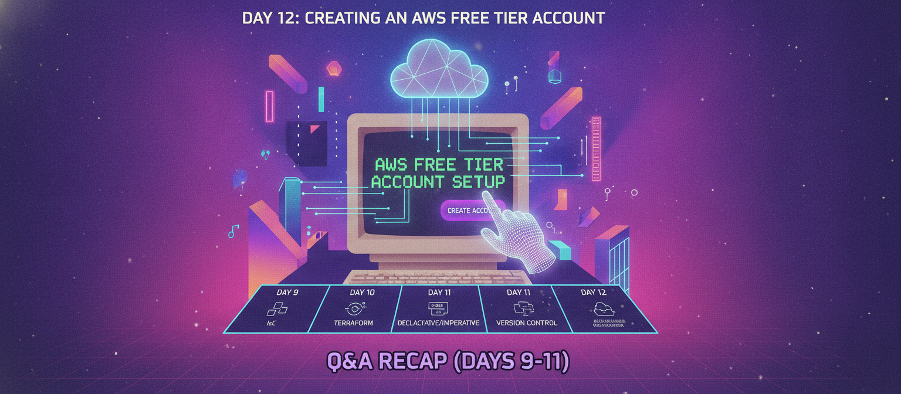

# Day 12: Creating an AWS Free Tier Account + Q&A Recap (Days 9-11)

Time to get hands-on. Today: how to create an AWS Free Tier account, plus a quick Q&A recap covering everything from Days 9-11.

## How to Create an AWS Free Tier Account

1. Go to aws.amazon.com and click "Create an AWS Account"
2. Enter your email address and choose an AWS account name
3. Verify your email with the confirmation code sent to you
4. Set a strong root password for your account
5. Enter your contact information (name, phone number, address)
6. Enter payment information — a valid credit/debit card is required even for free tier usage, mainly for identity verification
7. Complete phone number verification via SMS or call
8. Choose a support plan — select the **Basic Support (Free)** plan
9. Your account is created, and you're taken to the AWS Management Console

## Q&A Recap — Days 9-11

**Q: What is AWS?**
A: A secure cloud service platform offering compute, database, storage, and other resources to help businesses scale.

**Q: How many services does AWS provide?**
A: 175+.

**Q: What is an AWS Region?**
A: A separate geographic area containing a set of Availability Zones.

**Q: How many Regions does AWS currently have?**
A: 34.

**Q: Do Regions communicate with each other by default?**
A: No — only if required/configured.

**Q: What is an Availability Zone (AZ)?**
A: A data center (or group of data centers) within a Region.

**Q: What gives each AZ independent reliability?**
A: Independent power supply, cooling system, and physical security.

**Q: What are Local Zones used for?**
A: Deploying workloads needing single-digit millisecond latency, closer to population centers without a full Region.

**Q: What does AWS Direct Connect provide?**
A: A private, dedicated network connection between AWS and your own datacenter/office.

**Q: What are POP (Points of Presence) locations used for?**
A: Caching content closer to end users, powering Amazon CloudFront's low-latency delivery.

**Q: What is Elasticity?**
A: Increasing or decreasing the number of servers based on load — short-term, achieved via Auto Scaling.

**Q: What is Scalability?**
A: Increasing the capacity of a single server — long-term, achieved by changing instance type.

**Q: What is Elasticity also called?**
A: Horizontal Scaling.

**Q: What is Scalability also called?**
A: Vertical Scaling.

**Q: What are the three pillars of High Availability?**
A: Redundancy, Monitoring, and Failover.

**Q: How often does a Load Balancer perform health checks?**
A: Every 30 seconds.

**Q: What does AWS Elastic Beanstalk represent in terms of service model?**
A: PaaS — you upload your app, and AWS handles the rest.

**Q: What does EC2 represent in terms of service model?**
A: IaaS — you manage most of the setup yourself.

**Q: Name three AWS Compute services.**
A: EC2, Auto Scaling, Lambda.

**Q: Name three AWS Storage services.**
A: S3, EBS, S3 Glacier.

**Q: Name three AWS Database services.**
A: RDS, DynamoDB, Aurora.

**Q: What does AWS IAM manage?**
A: Secure access to AWS services and resources.

**Q: What are the three ways to access AWS resources?**
A: AWS CLI, Management Console, and SDKs.

---

## Where to read & follow
- Dev.to: https://dev.to/sr-palatasingh/series/42698
- Hashnode: https://sr-palatasingh.hashnode.dev/series/aws-devops-blog
- LinkedIn: https://www.linkedin.com/in/soumyaranjan-palatasingh/

**Coming up next:** Introduction to AWS Services.
