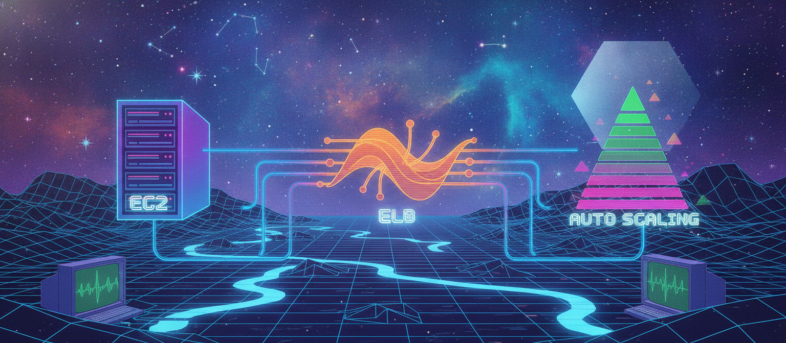

# Day 13: AWS Compute Core — EC2, ELB, and Auto Scaling

Previously (Days 9-12) We covered AWS fundamentals — global infrastructure, elasticity/scalability/HA, service categories, and getting your Free Tier account set up. Starting today, we move into the main event: an 11-day run through individual AWS services, two or three at a time. We're beginning where most people start their AWS journey — the raw compute layer: EC2, Elastic Load Balancer, and Auto Scaling.

## 1. Amazon EC2 (Elastic Compute Cloud) — Your virtual server

EC2 lets you create virtual machines in the cloud, called instances. It's the AWS service where you launch and fully control servers yourself.

**IaaS vs PaaS vs SaaS — the model that explains why EC2 looks the way it does:**

| Layer | Who manages it in IaaS (EC2) | Who manages it in PaaS | Who manages it in SaaS |
|---|---|---|---|
| Application + Data | You (customer) | You (customer) | Provider |
| OS | You (customer) | Provider | Provider |
| Virtualization, Data Center, Network | Provider (AWS) | Provider | Provider |

The simplest way to remember it: **IaaS** = you cook the biryani yourself — full control, full responsibility (EC2). **PaaS** = you eat at a restaurant — someone else runs the kitchen (Elastic Beanstalk). **SaaS** = you order on Swiggy/Zomato — everything's handled, you just consume (Gmail, Salesforce).

With EC2, you get a physical host machine → hypervisor → your VM instances. You choose the OS, install what you need, and manage patching, scaling, and availability yourself — which is exactly why the rest of this post exists.

A few building blocks are worth understanding before we get to ELB and Auto Scaling, since both depend on them. An **AMI (Amazon Machine Image)** is the template an instance launches from — it bundles the OS and any pre-installed software. AWS provides default AMIs (Amazon Linux, Ubuntu, Windows Server), and you can also create your own custom AMI from a configured instance so you don't have to redo setup every time. The **instance type** is the CPU, memory, and network combination the instance runs on — t3.micro, m5.large, and so on — and it's exactly what you change when you do vertical scaling (more on that below). A **key pair** is the public/private key AWS uses so you can securely SSH into a Linux instance or RDP into a Windows instance instead of relying on a password. And a **security group** is the virtual firewall attached to the instance, controlling exactly what traffic is allowed in and out, by port and protocol.

## 2. Elasticity — Handling traffic that goes up and down

The setup: a Load Balancer sits in front of a group of EC2 instances running your application (an Auto Scaling Group). As traffic increases, you need more instances; as it drops, you don't want to keep paying for idle capacity.

**Elasticity** = automatically increasing or decreasing the *number* of servers based on load. Scale out means adding instances, scale in means removing them. This is achieved in AWS through Auto Scaling, and it's considered short-term — a reaction to traffic spikes, not a permanent capacity change. Elasticity is also called **horizontal scaling**, since you're adding more machines rather than making one machine bigger.

## 3. Scalability — Making a single server bigger

Where elasticity is about the number of servers, **scalability** is about the size of a server. Example from class: a database server running on an 8GB RAM machine starts slowing down as data grows toward 10TB across 100 databases — the fix is bumping it up to 32GB RAM.

Scalability means scaling up (bigger instance) or scaling down (smaller instance). In AWS, this is done by changing the instance type — that CPU + memory combination from earlier. Unlike elasticity, this requires stopping the instance first. Scalability is considered long-term and is also called **vertical scaling**.

**Elasticity vs Scalability, side by side:**

| | Elasticity | Scalability |
|---|---|---|
| Changes | Number of servers | Size of one server |
| Direction | Scale out / Scale in | Scale up / Scale down |
| Term | Short-term | Long-term |
| Also known as | Horizontal scaling | Vertical scaling |
| Downtime needed? | No | Yes (instance must be stopped) |

## 4. High Availability — Staying up when things go wrong

**High Availability (HA)** is the percentage of time a service is actually available to customers. The flip side — the time it's not available — is downtime.

HA in AWS rests on three pillars. **Redundancy** means running the same application on multiple servers, so no single point of failure exists. **Monitoring** means the Load Balancer continuously runs health checks against the application itself (not the server) roughly every 30 seconds — a success response (HTTP 200) means the app is considered healthy. And **failover** means that if one server goes down, the Load Balancer automatically routes traffic to the remaining healthy servers.

Put together: **Auto Scaling + zero downtime = fault tolerance.**

## 5. Elastic Load Balancer (ELB) — The traffic cop

ELB is a fully managed AWS service that distributes incoming traffic across multiple EC2 instances, spread across Availability Zones.

The first thing that surprises people coming from on-premises setups: it's not a server. You can't SSH into it, patch it, or log into it at all — you access it only through a DNS name (URL) that AWS provides, not an IP you manage yourself. It's also created at the Regional level and isn't tied to a specific Availability Zone the way an EC2 instance is. On-premises, teams typically install their own web server (like Nginx or Apache) to act as a load balancer — and still have to build HA, Auto Scaling, and scalability by hand. ELB gives you all of that out of the box, managed by AWS.

AWS actually offers three types of load balancer. The **Application Load Balancer (ALB)** operates at Layer 7 and works with HTTP/HTTPS traffic, supporting content-based routing — you can send a request for `/api` to one group of servers and `/images` to another. The **Network Load Balancer (NLB)** operates at Layer 4, built for extreme performance and very low latency on TCP/UDP traffic. And the **Classic Load Balancer (CLB)** is the legacy option you'll mostly see in older setups. When people say "ELB" generically, they usually mean ALB today — it's the default choice for most web applications.

Two more concepts that matter once you're actually configuring one: a **listener** checks a specific port and protocol for incoming connection requests — for example, listening on port 443 for HTTPS. A **target group** is the actual set of EC2 instances (or IP addresses, or even Lambda functions) that a listener forwards traffic to. You register and deregister instances from the target group rather than pointing the ELB directly at instances, which is what makes it possible to add or remove capacity without ever touching the load balancer itself. There's also **cross-zone load balancing** — when enabled, traffic gets distributed evenly across every registered instance in every enabled Availability Zone, rather than staying balanced only within the AZ where it first arrived.

This is where the health checks from earlier actually live: they happen at the target group level, and a success response is what tells the ELB an instance is healthy enough to keep receiving traffic.

## 6. Auto Scaling

Auto Scaling is what actually delivers the elasticity concept in practice — automatically increasing or decreasing the number of EC2 instances based on load, without anyone doing it by hand.

Setting it up comes down to three pieces working together. The **Launch Template** defines what a brand-new instance should look like — its AMI, instance type, key pair, and security groups. Every instance the Auto Scaling Group creates is essentially a clone of this template. The **Auto Scaling Group (ASG)** itself defines the boundaries: the minimum, desired, and maximum number of instances, along with which Availability Zones or subnets instances are allowed to launch into. And the **scaling policy** is the actual rule that decides *when* scaling should happen.

There are a few ways to define that rule. **Target tracking** is the simplest — you pick a metric, say average CPU utilization, set a target like 50%, and AWS automatically adds or removes instances to hold that target. **Step scaling** gives you more control: you define specific thresholds and exactly how many instances to add or remove at each one. And **scheduled scaling** is useful when your traffic follows a predictable pattern rather than reacting to load in real time — for example, scaling up every weekday at 9 AM and back down at 11 PM.

One detail that trips people up early on: after a scale-out or scale-in event, there's usually a **cooldown period** — a window where the ASG deliberately won't trigger another scaling action, to avoid reacting to the same spike twice before the first batch of instances has stabilized.

## Putting it together

Put an ELB in front of an Auto Scaling Group and you get the complete picture: traffic arrives at the ELB's DNS name, gets spread across the healthy instances registered in the target group, and Auto Scaling quietly adjusts capacity up or down as demand shifts — all without manual intervention, and without downtime even if an individual server fails.

## Quick Recap Questions

1. What's the difference between elasticity and scalability, and which one requires downtime?
2. How does a Load Balancer know whether an application is healthy?
3. Why can't you SSH into an ELB the way you can into an EC2 instance?
4. In the biryani analogy, which service model does EC2 represent, and why?

## Where to read & follow

- Hashnode: https://sr-palatasingh.hashnode.dev/series/aws-devops-blog
- Dev.to: https://dev.to/sr-palatasingh/series/42698
- LinkedIn: https://www.linkedin.com/in/soumyaranjan-palatasingh/

## Coming up next

| Day | Topic | Services |
|---|---|---|
| 14 | Compute — Managed & Serverless | Elastic Beanstalk, Lightsail, Lambda, EventBridge |

#aws #devops #cloudcomputing #learning
