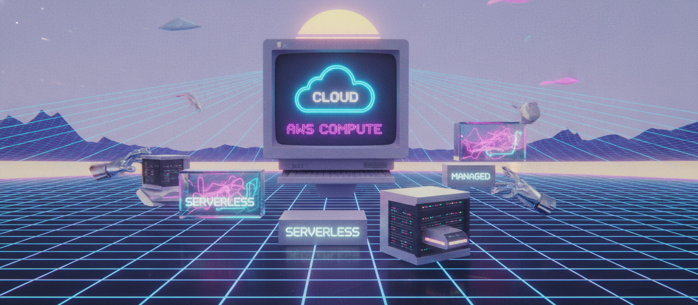

# Day 14: AWS Compute — Managed & Serverless

We started the compute layer on Day 13 with EC2, ELB, and Auto Scaling — where you launch and manage everything yourself. Today we move one level up the abstraction ladder: services where AWS takes over more of the operational burden.

## AWS Elastic Beanstalk

PaaS built on top of EC2. You upload code + config; Beanstalk provisions the EC2 instances, load balancer, and Auto Scaling Group for you. Pick a platform (Tomcat, .NET, Python, Docker, Go), upload your app, and get a URL back.

Unlike typical PaaS, you still get full access to the EC2 instances it creates — Beanstalk manages the lifecycle, not your access. Good for shipping fast without building your own CI/CD-to-EC2 pipeline; teams needing fine-grained control (custom networking, non-standard scaling) tend to graduate out of it eventually.

## Amazon Lightsail

Simplified VPS, pre-installed with common stacks (WordPress, GitLab, Node.js, Joomla, Drupal, Redmine, Nginx, cPanel). No Auto Scaling support. Built for small businesses and non-technical users, with flat, predictable pricing. Good fit until scaling, HA, or custom networking enters the picture — then migrate to EC2 + ELB + Auto Scaling.

## AWS Lambda

Serverless compute — write a function, Lambda runs it on trigger, no server to manage. Supports Java, Python, Ruby, Node.js. Billed on execution time/requests, not idle capacity.

- **Cold starts** — first invocation after inactivity is slightly slower while AWS spins up the environment
- **Max execution time** — 15 minutes per invocation
- **Common uses** — image resizing on S3 upload, lightweight API backends (paired with API Gateway), glue logic between services, scheduled automation (e.g. EC2 stop/start at 11 PM / 9 AM)

## Amazon EventBridge

Serverless event bus — captures events across AWS (and SaaS apps), routes them to targets (commonly Lambda) based on rules.

**Example flow:** EventBridge rule ("every day at 11 PM") → invokes Lambda function (Python) → Lambda stops EC2 instances.

**EventBridge vs SNS:** SNS = pub/sub notifications (email, SMS, services). EventBridge = rule-based event routing, including third-party SaaS sources. Use EventBridge for event-driven automation within AWS; SNS for simple notification fan-out.

## Comparison

| Service | Control Level | Best For |
|---|---|---|
| Elastic Beanstalk | Managed infra, full app control | Fast deployment without a custom pipeline |
| Lightsail | Minimal control, pre-built stacks | Small business sites, non-technical use cases |
| Lambda | No servers at all | Short, event-driven tasks and automation |
| EventBridge | No servers at all | Routing events to the right target |

## Recap Questions
- [ ] EC2 vs Elastic Beanstalk — who manages the servers?
- [ ] Why no Auto Scaling on Lightsail?
- [ ] EventBridge's role vs Lambda's role in the stop/start example?
- [ ] Max Lambda execution time?

---
Next: Day 15 — Networking Basics (VPC, Route 53)
