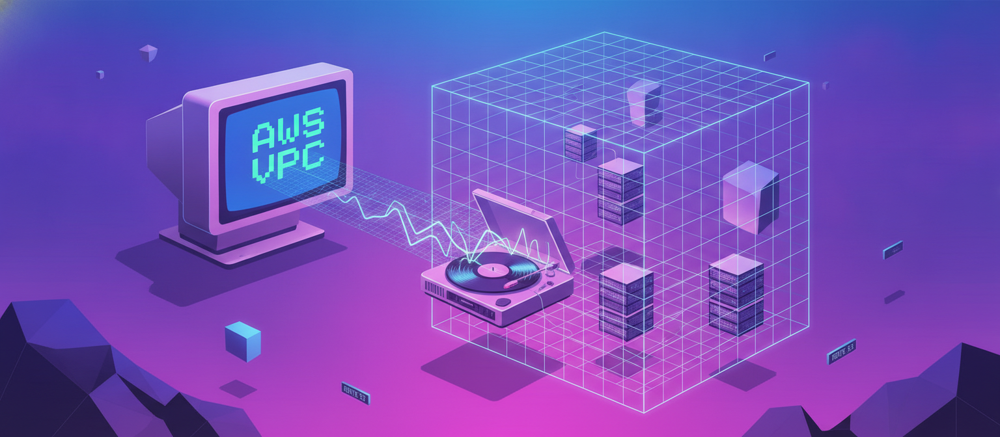
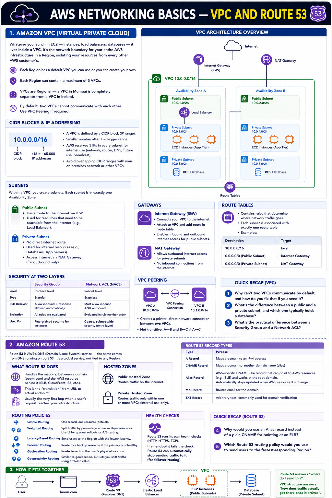

# Day 15: AWS Networking Basics — VPC and Route 53

Days 13-14 covered compute, from raw EC2 up through Beanstalk, Lightsail, Lambda, and EventBridge. Today we move into networking — starting with the two services that sit underneath almost everything else you'll deploy: VPC and Route 53.

## Amazon VPC (Virtual Private Cloud)

Whatever you launch in EC2 — instances, load balancers, databases — it lives inside a VPC. It's the network boundary for your entire AWS infrastructure in a Region, isolating your resources from every other AWS customer's.

AWS gives every Region a default VPC you can use right away, or you can create your own. Each Region can contain a maximum of 5 VPCs, and VPCs are Regional — a VPC in Mumbai is a completely separate, unrelated thing from a VPC in Ireland, even within the same account. By default, two VPCs cannot communicate with each other at all. If you need that — say, two teams' environments that occasionally need to talk — you have to explicitly set it up.

**CIDR blocks and IP addressing.** A VPC is defined by a CIDR block — a range of IP addresses written like `10.0.0.0/16`. The `/16` tells you how many addresses are in that range (a /16 gives you roughly 65,000 addresses); a smaller number after the slash means a bigger range. AWS reserves 5 IP addresses in every subnet for internal use (network address, VPC router, DNS, future use, and broadcast), so your usable address count is always a bit less than the raw math suggests. Picking a CIDR range that doesn't overlap with your on-premises network or other VPCs matters a lot if you ever plan to connect them together — overlapping ranges are one of the most common real-world networking headaches.

**Subnets.** Within a VPC, you carve out subnets — smaller IP ranges, each tied to exactly one Availability Zone. Subnets typically come in two flavors:
- **Public subnets** have a route to the internet through an Internet Gateway. This is usually where your load balancer or any internet-facing resource sits.
- **Private subnets** have no direct internet route. Databases, internal application servers, and anything that shouldn't be reachable from outside sit here.

A well-architected VPC usually spreads public and private subnets across multiple Availability Zones — the same high-availability principle from Day 13, applied at the network layer.

**Gateways.** An Internet Gateway is what actually connects a VPC to the internet. Attach one to your VPC, add a route to it in your route table, and resources in public subnets can reach — and be reached from — the outside world. For private subnets that still need *outbound* internet access (downloading OS patches, calling an external API) without being directly reachable from outside, you use a NAT Gateway instead — traffic flows out through it, but nothing can initiate a new connection back in through it.

**Route tables** are the actual traffic-direction rules: which subnet's traffic goes to the Internet Gateway, which goes to the NAT Gateway, which stays entirely internal. Every subnet is associated with exactly one route table (though one route table can be shared across multiple subnets).

**Security at two layers.** Security groups (which we touched on with EC2) are stateful firewalls attached at the instance level — if you allow inbound traffic on a port, the response traffic is automatically allowed out. Network ACLs (NACLs) sit at the subnet level instead, are stateless (you have to explicitly allow both inbound and outbound), and are evaluated in rule-number order. In practice, most day-to-day security is handled with security groups; NACLs are more of a coarse, subnet-wide backstop.

**VPC Peering** creates a private, direct network connection between two VPCs that genuinely need to talk to each other — this is the "if required, yes" answer to the two-VPCs-communicating question. It's not transitive, though: if VPC A peers with B, and B peers with C, A still can't reach C without its own direct peering connection.

## Amazon Route 53

Route 53 is AWS's DNS (Domain Name System) service — the name comes from DNS running on port 53. Unlike VPC, it's a global service, not tied to any Region.

At its core, Route 53 handles the mapping between a human-readable domain (like boom.com) and the actual AWS resource behind it — an ELB, a CloudFront distribution, an S3 bucket, and so on. You create records inside Route 53 to define that mapping. This is where the "translation" from a URL to an actual endpoint happens, and it's typically the very first hop when a user's request reaches your infrastructure.

**Hosted zones.** Records live inside a hosted zone — a container for all the DNS records belonging to one domain. A public hosted zone routes traffic on the internet; a private hosted zone routes traffic only within one or more VPCs, useful for internal-only services that shouldn't be resolvable publicly.

**Record types worth knowing**, beyond just "a record maps a name to an address":
- **A record** — maps a domain to an IPv4 address
- **CNAME record** — maps a domain to another domain name (an alias)
- **Alias record** — an AWS-specific enhancement of a CNAME-like mapping that works even at the root domain, and lets you point directly at an AWS resource (like an ELB's DNS name) instead of a static IP — this matters because AWS resource IPs can change, and an Alias record automatically stays current
- **MX record** — routes email for the domain
- **TXT record** — arbitrary text, commonly used for domain verification (proving you own a domain to a third-party service)

**Routing policies** go well beyond simple one-to-one mapping:
- **Simple routing** — one record, one resource; the default
- **Weighted routing** — split traffic by percentage across multiple resources, useful for gradual rollouts or A/B testing
- **Latency-based routing** — send users to whichever Region responds fastest for them
- **Failover routing** — automatically route to a backup resource if the primary is unhealthy
- **Geolocation routing** — route based on the user's physical location, useful for serving region-specific content or complying with data residency rules
- **Geoproximity routing** — similar, but lets you shift traffic between resources by adjusting a "bias" value, without needing exact geographic boundaries

Route 53 also runs its own health checks — separate from the ELB-level health checks we covered on Day 13 — which continuously monitor an endpoint and can automatically pull it out of rotation for failover routing if it stops responding.

## How it fits together

A typical request flow looks like this: a user types boom.com → Route 53 resolves that to your Elastic Load Balancer's DNS name (often via an Alias record) → the ELB distributes the request across EC2 instances sitting in your VPC's public subnets. Route 53 answers "where do I send this," and the VPC's structure — subnets, gateways, route tables — answers "how does traffic actually get there once it arrives."

## Quick Recap Questions

1. Why can't two VPCs communicate with each other by default, and how do you fix that if you need it?
2. What's the difference between a public and a private subnet, and which one typically holds a database?
3. What's the practical difference between a Security Group and a Network ACL?
4. Why would you use an Alias record instead of a plain CNAME for pointing at an ELB?
5. Which Route 53 routing policy would you use to send users to the fastest-responding Region?

## Where to read & follow

- Hashnode: https://sr-palatasingh.hashnode.dev/series/aws-devops-blog
- Dev.to: https://dev.to/sr-palatasingh/series/42698
- LinkedIn: https://www.linkedin.com/in/soumyaranjan-palatasingh/

## Coming up next

| Day | Topic | Services |
|---|---|---|
| 16 | Networking — Connectivity & Delivery | Direct Connect, CloudFront/CDN |

#aws #devops #cloudcomputing #learning
