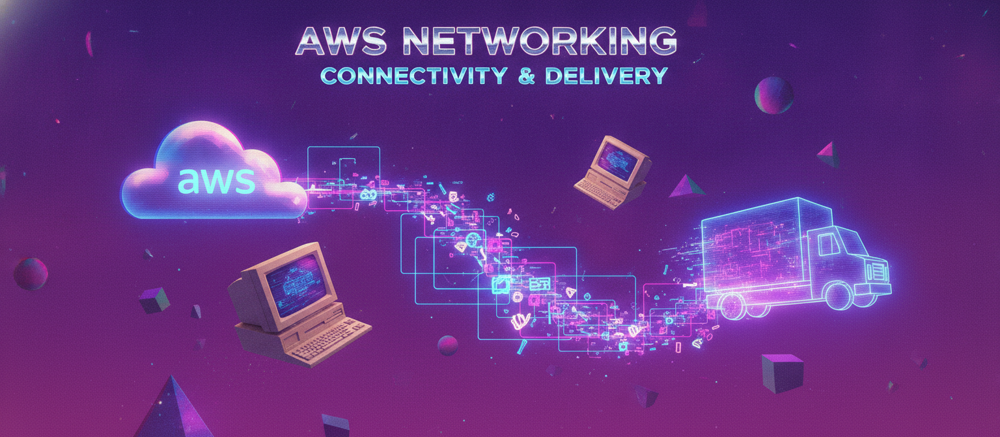
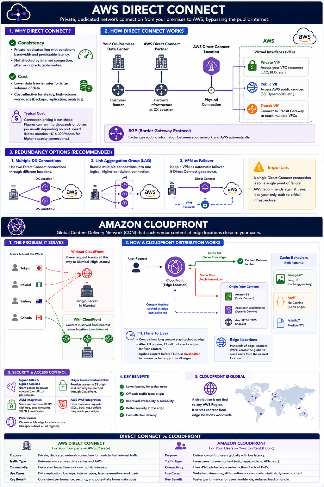

# Day 16: AWS Networking — Connectivity & Delivery

Day 15 covered VPC and Route 53 — how your infrastructure is structured and how a domain name resolves to it. Today we cover the two services that decide how traffic actually travels between your users, your company, and AWS: Direct Connect and CloudFront.

## AWS Direct Connect

By default, your company reaches AWS the same way everyone else does — over the public internet, usually through a VPN for anything sensitive. Direct Connect replaces that with a dedicated, leased-line connection straight from your premises to AWS, bypassing the public internet entirely.

**Why not just use a VPN, since it already encrypts traffic?** Two reasons come up constantly: consistency and cost. A VPN over the public internet is still subject to the internet's variability — congestion, unpredictable latency, and jitter that no security team can fully control, because the traffic is still hopping across a chain of ISPs you don't own. Direct Connect gives you a private, dedicated line with consistent, guaranteed bandwidth and predictable latency, which matters a lot for latency-sensitive workloads (real-time trading systems, VoIP, live data replication) or for a steady, high-volume flow of confidential data between an on-premises data center and AWS. On the cost side, transferring large volumes of data *out* of AWS over the public internet gets expensive at scale — Direct Connect's data transfer rates are generally lower, so heavy data-transfer workloads (nightly backups, large analytics pipelines, ongoing replication) can actually save money over time despite the connection itself not being cheap (pricing runs into the thousands of dollars per month depending on port speed, with figures around $16,000/month for higher-capacity connections).

**How the pieces fit together.** A Direct Connect connection physically terminates at an AWS Direct Connect location — a facility, often run by a third-party colocation provider, where AWS has a direct presence. You typically don't wire your own cable there yourself; you go through an **AWS Direct Connect Partner** who already has infrastructure at that location and can provision the cross-connect for you, unless your company happens to already have equipment physically present there.

From that physical connection, you provision **Virtual Interfaces (VIFs)** to actually reach specific AWS resources:
- A **private VIF** connects to resources inside a single VPC — this is what you'd use to let your on-premises data center talk to EC2 instances or an RDS database sitting in a VPC.
- A **public VIF** reaches AWS's public services (like S3 or DynamoDB) using their public endpoints, but over the dedicated connection instead of the internet — useful when you want private connectivity to a service that doesn't live inside a VPC.
- A **transit VIF** connects to a Transit Gateway, which is how you extend Direct Connect access to *multiple* VPCs at once instead of just one.

Connections use **BGP (Border Gateway Protocol)** to exchange routing information between your network and AWS's, so routes update automatically rather than being manually maintained.

**Redundancy is a real design decision here, not an afterthought.** A single Direct Connect connection is still one physical link through one location — if that link or that location has an outage, you lose connectivity entirely unless you've planned for it. Common patterns: pairing two Direct Connect connections through different locations for full redundancy, using a **Link Aggregation Group (LAG)** to bundle multiple connections into one logical, higher-bandwidth connection, or keeping a VPN as an automatic failover path if Direct Connect goes down. AWS explicitly recommends against treating a single Direct Connect connection as your only path to critical infrastructure.

## Amazon CloudFront

CloudFront is AWS's Content Delivery Network (CDN) — a service that caches your content at locations physically close to your users, so they're not making every request all the way back to your origin server.

**The problem it solves, concretely:** say your application runs in Mumbai, but you have users in Tokyo, Ireland, Sydney, and Canada. Without CloudFront, every one of those users' requests travels all the way to Mumbai and back — that round trip is where most of the perceived slowness in a global application actually comes from, often more than anything happening on your server itself. You could deploy your application in every region your users are in, but that's expensive, operationally heavy, and creates data-consistency headaches across regions. CloudFront's answer is to cache your content at **edge locations** — AWS-managed points of presence spread globally, numbering in the hundreds — so a user in Tokyo gets served from a nearby edge location instead of round-tripping to Mumbai.

**How a distribution actually works.** You create a **distribution** in CloudFront, pointing it at an **origin** — the actual source of your content, which could be an S3 bucket (for static assets), an Application Load Balancer (for dynamic content), or basically any HTTP/HTTPS endpoint, even one outside AWS entirely. From then on, requests hit the nearest edge location first: if that edge already has the requested content cached, it serves it directly (a "cache hit") — no trip back to the origin at all. If not (a "cache miss"), it fetches the content from the origin once, caches it at that edge, and serves subsequent nearby requests from the cache until it expires.

A single distribution can also define multiple **cache behaviors** — rules based on the URL path pattern. You might cache `/images/*` aggressively for a long time since images rarely change, while routing `/api/*` straight to the origin with no caching at all since API responses need to be fresh every time. This is how a single CloudFront distribution can sit in front of both a static frontend and a dynamic backend.

**TTL (Time to Live)** controls how long content stays cached at an edge location before CloudFront checks the origin again for a fresh copy. If you update your content before the TTL expires, users will keep seeing the old cached version until it does — unless you explicitly **invalidate the cache**, which forces CloudFront to drop the cached copy at every edge and fetch fresh content on the next request. This is one of the most common gotchas in real deployments: shipping a fix to your origin doesn't mean users see it immediately if a stale copy is already sitting at the edge nearest them.

**Security and access control features worth knowing:**
- **Signed URLs and signed cookies** let you serve private content — a paid video, a licensed document — without making your entire origin publicly accessible.
- **Origin Access Control (OAC)** locks down an S3 origin so it can only be reached through CloudFront, not accessed directly via its raw S3 URL — the standard, current best practice for keeping an S3-backed website or asset bucket from being bypassed.
- CloudFront integrates directly with **ACM (AWS Certificate Manager)** to serve your content over HTTPS with a free, auto-renewing certificate, and with **AWS WAF** to filter malicious requests (SQL injection attempts, bot traffic) before they ever reach your origin.
- **Price classes** let you control which edge locations your distribution actually uses — you can restrict delivery to a cheaper subset of regions if you don't have users everywhere and want to control cost.

CloudFront is a **global** service, same as Route 53 — a distribution isn't tied to one Region, since its entire purpose is serving content from wherever the user happens to be.

## How they're different

Direct Connect and CloudFront solve opposite-feeling problems that are actually related: Direct Connect is about *your company* reaching AWS privately and consistently for internal, often confidential traffic. CloudFront is about *your users* reaching your public-facing content quickly, wherever in the world they happen to be. One tightens a single path between you and AWS; the other widens the number of places your content can be served from.

## Recap Questions
- [ ] Why would a company choose Direct Connect over a VPN if a VPN already encrypts traffic?
- [ ] What's the difference between a private VIF, a public VIF, and a transit VIF?
- [ ] What's a Link Aggregation Group, and why would you use one with Direct Connect?
- [ ] If you update content at your origin, why might users still see the old version — and what fixes it?
- [ ] What does Origin Access Control actually prevent?

## Where to read & follow

- Hashnode: https://sr-palatasingh.hashnode.dev/series/aws-devops-blog
- Dev.to: https://dev.to/sr-palatasingh/series/42698
- LinkedIn: https://www.linkedin.com/in/soumyaranjan-palatasingh/

---
Next: Day 17 — Storage Core (S3, EBS)
