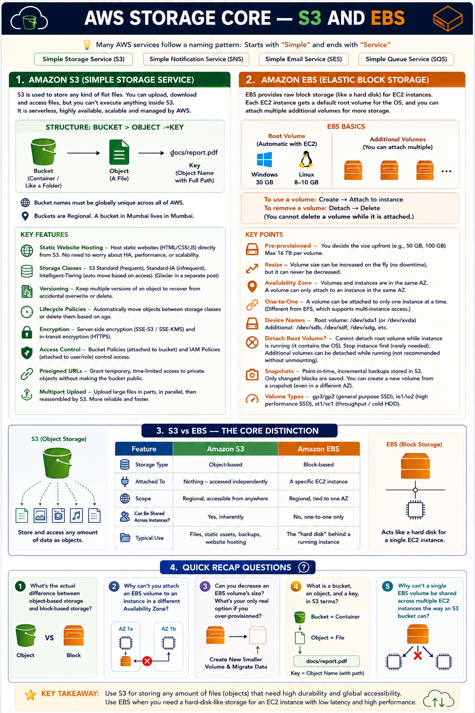

# Day 17: AWS Storage Core — S3 and EBS

Days 15-16 covered networking. Today we move into storage — the two foundational storage services almost everything else builds on: S3 and EBS. They solve fundamentally different problems, and knowing which fits which use case matters a lot in practice.

## Amazon S3 (Simple Storage Service)

S3 stores files. AWS follows a naming pattern here — starts with "Simple," ends with "Service" (same pattern as SNS, SES, SQS). S3 stores any kind of flat file; you can upload, download, and access files, but you can't execute anything inside S3 — no OS, no database, no executables. It's serverless, like Google Drive: no server to manage, patch, or scale — AWS handles HA, performance, and scalability entirely.

**The structure:** a **bucket** is a container of objects (like a folder). An **object** is a file. The **key** is the object's name, including its full path (e.g. `docs/report.pdf`). Buckets are Regional, and bucket names must be globally unique across all of AWS.

S3 is **object-based storage** — the key distinction from EBS's block-based model.

**Static website hosting:** for a static site (no server-side processing), just create a bucket, upload the HTML files, and enable static website hosting — S3 handles HA, performance, and scalability the same as any other object stored there.

**Beyond the fundamentals:**

| Concept | What it does |
|---|---|
| Storage classes | Standard (frequent access), Standard-IA (infrequent, cheaper), Intelligent-Tiering (auto-moves objects based on access patterns) |
| Versioning | Keeps multiple versions of an object — protects against accidental overwrite/delete |
| Lifecycle policies | Automate moving objects between storage classes or deleting them based on age |
| Encryption | Server-side (S3-managed or KMS-managed keys) + HTTPS in transit |
| Bucket policy vs IAM policy | Bucket policy attaches to the bucket (can grant cross-account access); IAM policy attaches to a user/role |
| Presigned URLs | Temporary, time-limited access to a private object without making the bucket public |
| Multipart upload | Splits large files into parts uploaded in parallel — more resilient than one large upload |

## Amazon EBS (Elastic Block Storage)

Where S3 stores files as objects, EBS gives you raw block storage — the AWS equivalent of a hard disk. Simplest framing: hard disk = volume = EBS volume.

Every EC2 instance gets a default **root volume** (contains the OS) on launch — 30GB for Windows, 8-10GB for Linux by default. Only one root volume per instance, but you can attach multiple **additional volumes**.

**Lifecycle:** create → attach; detach → delete (can't delete while attached). Volumes are **pre-provisioned** — you set the size upfront, up to **16TB max** per volume.

**Key facts:**
- Volume size can be **increased on the fly, zero downtime** — but **never decreased**. Over-provisioned? Create a smaller volume and migrate data over.
- A volume and the instance it attaches to must be in the **same Availability Zone**.
- A volume attaches to **only one instance at a time** — one-to-one, unlike shared storage like EFS (covered in an upcoming post).
- Device naming: root volume is typically `/dev/sda1` (or `/dev/xvda` on some instance types); additional volumes get `/dev/sdb`, `/dev/sdf`, `/dev/sdg`, etc.
- The root volume **can't be detached while the instance is running** (it holds the running OS) — stop the instance first. Additional volumes can technically detach while running, though unmounting properly first avoids corruption.

**Beyond the class notes:**
- **Volume types:** gp3/gp2 (general-purpose SSD, default choice), io1/io2 (provisioned IOPS SSD, high-performance databases), st1/sc1 (lower-cost HDD, throughput-heavy or cold data)
- **Snapshots:** point-in-time, incremental backups stored in S3 behind the scenes — only changed blocks are saved, and a new volume can be created from a snapshot anytime, including in a different AZ

## S3 vs EBS — the core distinction

| | S3 | EBS |
|---|---|---|
| Storage type | Object-based | Block-based |
| Attached to | Nothing — accessed independently | A specific EC2 instance |
| Scope | Regional, accessible from anywhere | Regional, tied to one AZ |
| Shared across instances? | Yes, inherently | No, one-to-one only |
| Typical use | Files, static assets, backups, website hosting | The "hard disk" behind a running instance |

## Recap Questions
- [ ] What's the difference between object-based and block-based storage?
- [ ] Why can't you attach an EBS volume across Availability Zones?
- [ ] Can you decrease an EBS volume's size?
- [ ] Define bucket, object, and key in S3 terms.
- [ ] Why can't one EBS volume be shared across multiple instances?

## Where to read & follow

- Hashnode: https://sr-palatasingh.hashnode.dev/series/aws-devops-blog
- Dev.to: https://dev.to/sr-palatasingh/series/42698
- LinkedIn: https://www.linkedin.com/in/soumyaranjan-palatasingh/

---
Next: Day 18 — Storage Extended (EFS, Snow Family, Glacier, Storage Gateway)
