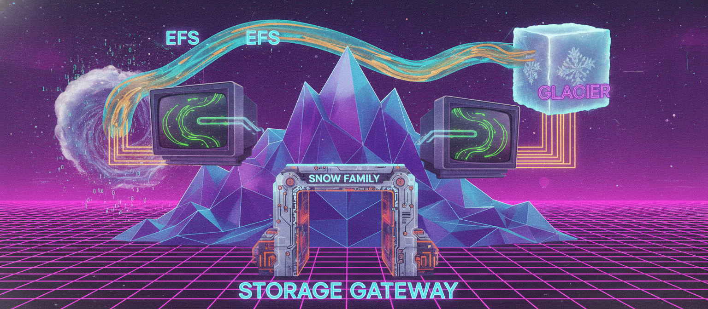
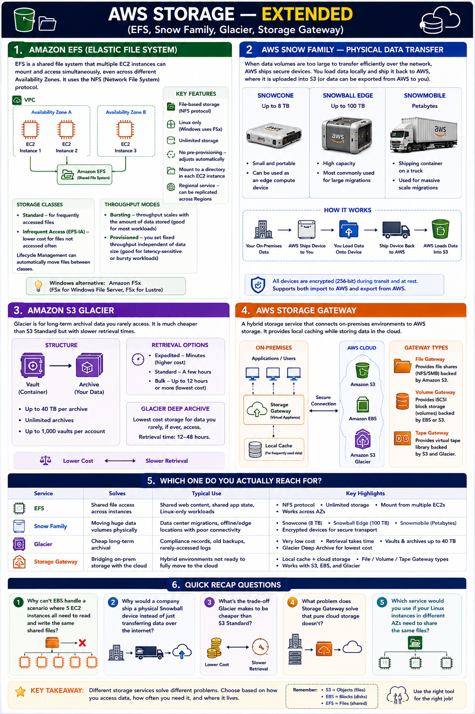

# Day 18: AWS Storage — Extended (EFS, Snow Family, Glacier, Storage Gateway)

Day 17 covered S3 and EBS. Today we round out storage with four services that each solve a specific gap those two leave open: sharing storage across instances, moving huge volumes of data physically, archiving cheaply, and bridging on-premises storage with the cloud.

## Amazon EFS (Elastic File System)

EBS attaches to only one EC2 instance at a time — it can't serve multiple instances reading/writing the same shared storage. EFS fills that gap: a shared file system multiple EC2 instances can mount and access simultaneously, even across different AZs, using the **NFS protocol**.

**Defining characteristics:**
- **File-based storage** (vs EBS block-based, S3 object-based)
- **Linux only** — Windows instances use FSx instead
- **Unlimited storage**, **no pre-provisioning** — grows/shrinks automatically
- Mounted to a directory inside each EC2 instance
- **Regional**, but can be replicated to other Regions

**Beyond the basics:**

| Feature | Detail |
|---|---|
| Storage classes | Standard (active) + Infrequent Access (cheaper, less-used files); Lifecycle Management moves files automatically |
| Throughput modes | Bursting (scales with data stored) or Provisioned (fixed, independent of storage size) |
| FSx | Windows equivalent — FSx for Windows File Server (SMB), FSx for Lustre (HPC workloads) |

## AWS Snow Family — Physical data transfer

For data volumes too large to move efficiently over a network — petabytes could take weeks or months online — AWS ships a rugged, secure device: load data locally, ship it to AWS, they upload it into S3 (or reverse, for exporting out).

| Device | Capacity | Use case |
|---|---|---|
| Snowcone | Up to 8TB | Small, portable, can double as edge compute |
| Snowball Edge | Up to 100TB | Standard large migrations |
| Snowmobile | Petabytes | Entire data-center-scale migrations (shipping container on a truck) |

All devices use 256-bit encryption in transit.

## Amazon S3 Glacier

S3's archival counterpart — for data retained but rarely accessed (compliance records, old backups). Significantly cheaper than S3 Standard, trading off retrieval speed.

- **Vault** = container for archives (like a bucket)
- **Archive** = the stored data — up to 40TB each, unlimited archives, max 1,000 vaults per account

**Retrieval tiers:**

| Tier | Speed | Cost |
|---|---|---|
| Expedited | Minutes | Premium |
| Standard | A few hours | Moderate |
| Bulk | ~12+ hours | Cheapest for large volumes |
| Deep Archive | Hours (separate, even cheaper class) | Lowest overall |

## AWS Storage Gateway

Hybrid storage — a virtual appliance run on-premises connecting local environments to AWS storage (S3, EBS, Glacier) behind the scenes. Gives local caching for low-latency access to hot data, while the bulk lives durably in the cloud.

| Type | Presents as | Backed by |
|---|---|---|
| File Gateway | Standard file share | S3 |
| Volume Gateway | iSCSI block volumes (cached or stored mode) | EBS/S3 |
| Tape Gateway | Virtual tape library | S3 + Glacier |

## Which one do you actually reach for?

| Service | Solves | Typical Use |
|---|---|---|
| EFS | Shared file access across instances | Shared web content, shared app state, Linux-only |
| Snow Family | Moving huge data volumes physically | Data center migrations, poor-connectivity sites |
| Glacier | Cheap long-term archival | Compliance records, old backups |
| Storage Gateway | Bridging on-prem storage with the cloud | Hybrid environments not fully cloud-migrated |

## Recap Questions
- [ ] Why can't EBS handle 5 EC2 instances all needing the same shared files?
- [ ] Why ship a physical Snowball instead of transferring over the internet?
- [ ] What's Glacier's trade-off for being cheaper than S3 Standard?
- [ ] What problem does Storage Gateway solve that pure cloud storage doesn't?

## Where to read & follow

- Hashnode: https://sr-palatasingh.hashnode.dev/series/aws-devops-blog
- Dev.to: https://dev.to/sr-palatasingh/series/42698
- LinkedIn: https://www.linkedin.com/in/soumyaranjan-palatasingh/

---
Next: Day 19 — Database: Relational (RDS, DMS)
