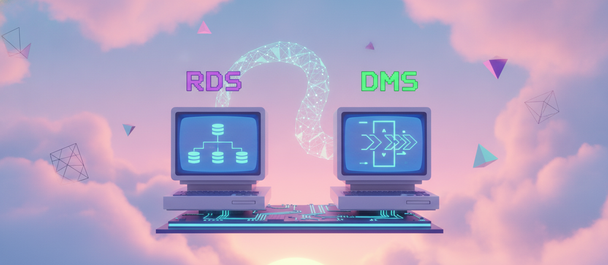
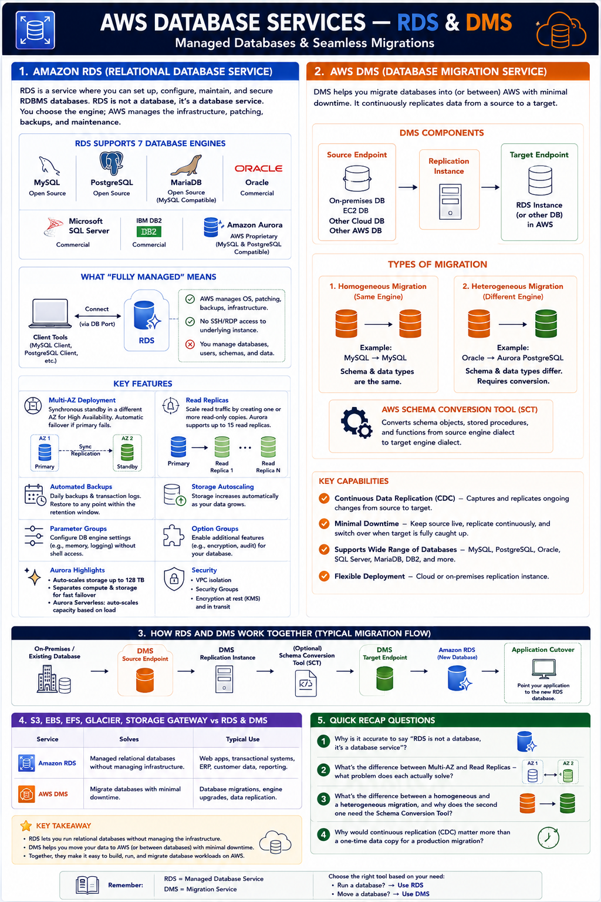

# Day 19: AWS Database — Relational (RDS and DMS)

Days 17-18 covered storage. Today we shift into databases — RDS, which most applications lean on for their primary database, and DMS, the service that gets data into it in the first place.

## Amazon RDS (Relational Database Service)

RDS lets you set up, configure, maintain, and secure RDBMS databases — but **RDS is not a database, it's a database service**. You don't install the engine yourself; you pick one, and RDS provisions, patches, backs up, and manages the underlying infrastructure.

**7 supported engines:** MySQL, PostgreSQL, MariaDB, Oracle, Microsoft SQL Server, IBM DB2, and **Aurora** — AWS's own proprietary engine, compatible with MySQL/PostgreSQL but re-engineered for better performance on AWS infrastructure.

**What "fully managed" means:** you connect only through client tools over the database port — no RDP/SSH to the underlying instance. Trade-off: no OS-level access, but AWS handles patching, backups, and infrastructure maintenance.

**Key features:**

| Feature | What it does |
|---|---|
| Multi-AZ | Synchronous standby in a different AZ; automatic failover on primary failure — HA at the database layer |
| Read Replicas | Read-only copies to scale read traffic (separate from Multi-AZ); Aurora supports up to 15 |
| Automated backups/snapshots | Daily backups + transaction logs for point-in-time restore; manual snapshots on demand |
| Storage autoscaling | Storage grows automatically as data grows |
| Parameter/option groups | Configure engine settings without shell access to the instance |
| Aurora specifics | Auto-scales storage to 128TB, separates compute/storage for faster failover, Aurora Serverless option |

## AWS DMS (Database Migration Service)

Exists for one purpose: migrating databases into (or between) AWS with minimal downtime.

**Three pieces:** a **source endpoint** (existing database), a **target endpoint** (typically RDS), and a **replication instance** (the compute that reads from source, writes to target).

**Two migration types:**
- **Homogeneous** — same engine (e.g. MySQL → MySQL), schema/types line up directly
- **Heterogeneous** — different engines (e.g. Oracle → Aurora PostgreSQL), requires schema conversion via the **Schema Conversion Tool (SCT)** before DMS moves the data

DMS also supports **continuous replication (CDC — Change Data Capture)** — not just a one-time copy. The source stays live in production while DMS continuously replicates changes, and cutover happens only once the target has caught up, minimizing downtime.

## How they work together

A typical migration flow: your existing database (on-premises or elsewhere) becomes the DMS source endpoint, a DMS replication instance continuously copies data — and if needed, the Schema Conversion Tool translates the schema first — into a target RDS instance, and once replication has caught up, you cut your application over to the new RDS database with minimal downtime.

## Quick Recap Questions

1. Why is it accurate to say "RDS is not a database, it's a database service"?
2. What's the difference between Multi-AZ and Read Replicas — what problem does each actually solve?
3. What's the difference between a homogeneous and a heterogeneous migration, and why does the second one need the Schema Conversion Tool?
4. Why would continuous replication (CDC) matter more than a one-time data copy for a production migration?

## Where to read & follow

- Hashnode: https://sr-palatasingh.hashnode.dev/series/aws-devops-blog
- Dev.to: https://dev.to/sr-palatasingh/series/42698
- LinkedIn: https://www.linkedin.com/in/soumyaranjan-palatasingh/

## Coming up next

| Day | Topic | Services |
|---|---|---|
| 20 | Database — NoSQL, Warehouse & Cache | DynamoDB, Redshift, ElastiCache |
