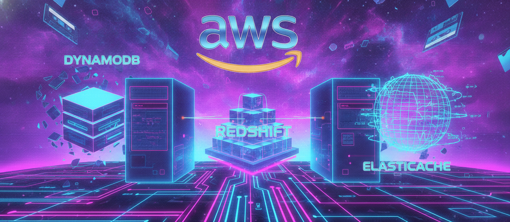
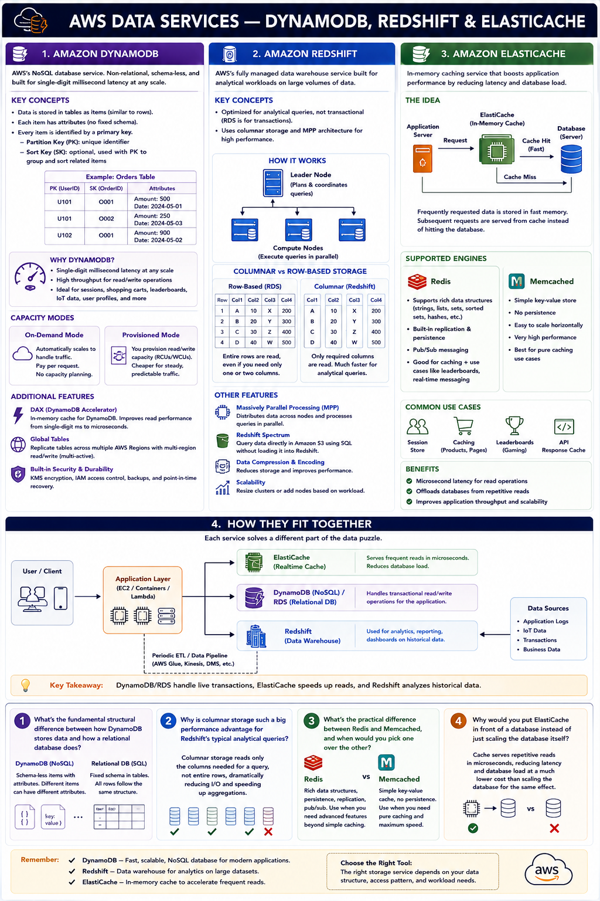

# Day 20: AWS Database — NoSQL, Warehouse & Cache (DynamoDB, Redshift, ElastiCache)

Day 19 covered RDS and DMS — the relational side. Today: three services that each solve a problem relational databases weren't built for — flexible high-speed data access at scale (DynamoDB), heavy analytical queries (Redshift), and shaving latency off frequently accessed data (ElastiCache).

## Amazon DynamoDB

AWS's NoSQL database service — non-relational, and one of the most commonly used AWS database services among developers due to low operational overhead.

Unlike a relational database's fixed-schema tables with joins, DynamoDB stores **items** (like rows) in **tables** with no fixed schema. Every item has a **primary key** — either just a **partition key**, or a composite **partition key + sort key** (for grouping and efficiently querying related items).

**Performance is the headline:** single-digit millisecond latency at virtually any scale — common for session storage, shopping carts, leaderboards, IoT ingestion.

**Capacity modes:**

| Mode | How it works |
|---|---|
| On-demand | Auto-scales to traffic, billed per request — good for unpredictable/spiky workloads |
| Provisioned | Set read/write capacity units upfront — cheaper at steady, predictable traffic |

**Beyond the basics:** **DAX (DynamoDB Accelerator)** is an in-memory cache in front of DynamoDB, pushing latency into microseconds for read-heavy workloads. **Global Tables** replicate a table across multiple Regions with multi-active read/write access.

## Amazon Redshift

If RDS is "database in AWS," Redshift is "data warehouse in AWS." RDS handles **transactional** workloads (fast, small reads/writes); Redshift handles **analytical** workloads (complex aggregation over huge historical datasets) — running that kind of query against a transactional database would bring it to a crawl.

**Why it's fast:** **columnar storage** — stores each column together rather than each row, so analytical queries touching only a few columns out of a wide table don't have to scan whole rows. **Massively Parallel Processing (MPP)** — a leader node plans/coordinates, multiple compute nodes execute the query in parallel across their own slice of data.

**Redshift Spectrum** — run SQL queries directly against data in S3 without loading it into Redshift first, useful for huge raw datasets queried only occasionally.

## Amazon ElastiCache

In-memory database caching service — reduces latency and boosts performance for frequently requested data. Sits in front of a database: repetitive requests for unchanged data get served from fast in-memory cache instead of round-tripping to the database.

**Two engines, not interchangeable:**

| Engine | Characteristics |
|---|---|
| Redis | Rich data structures, built-in replication + persistence, pub/sub — more than just caching |
| Memcached | Simpler, pure caching only, no persistence, easy horizontal scaling |

**Example:** a user searches a product 10 times in an hour — without caching, that's 10 database trips for identical data; with ElastiCache, the first hits the DB and caches, the next 9 serve instantly from cache.

## How they fit together

DynamoDB (or RDS) handles transactional reads/writes → ElastiCache absorbs repetitive, frequently-requested reads to cut latency and DB load → Redshift sits off to the side, ingesting data periodically for heavy analytical reporting unrelated to live app traffic.

## Recap Questions
- [ ] What's the structural difference between DynamoDB's data model and a relational database's?
- [ ] Why does columnar storage speed up Redshift's typical queries?
- [ ] Redis vs Memcached — what's the practical difference?
- [ ] Why put ElastiCache in front of a database instead of just scaling the database?

## Where to read & follow

- Hashnode: https://sr-palatasingh.hashnode.dev/series/aws-devops-blog
- Dev.to: https://dev.to/sr-palatasingh/series/42698
- LinkedIn: https://www.linkedin.com/in/soumyaranjan-palatasingh/

---
Next: Day 21 — Identity & Governance (IAM, Organizations)
