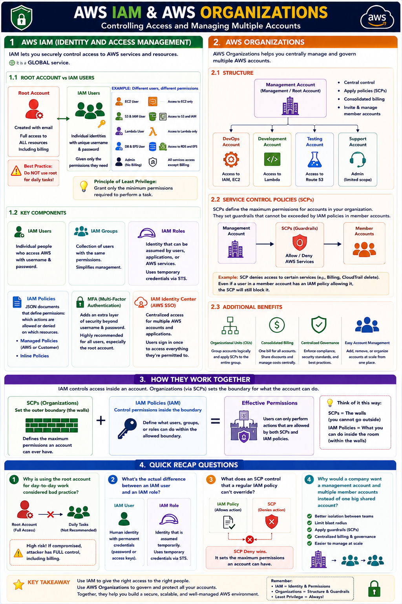

# Day 21: AWS Identity & Governance — IAM and Organizations

Day 20 wrapped up databases. Today: the layer that decides who can do what in your AWS account — IAM and Organizations. Arguably the most important security topic in the series; misconfigured permissions are one of the most common ways real companies get breached.

## AWS IAM (Identity and Access Management)

IAM controls access to all of AWS by granting proper permissions to identities. It's **global** — not tied to any Region.

Every account starts with a **root account** — created with email + password, with full unrestricted permissions including billing. Using it for daily work is bad practice: compromised root credentials mean complete account takeover. **IAM users** exist for exactly this reason — individual identities, each with only the specific permissions their role needs.

**Example:** one person needs EC2 access, another S3 + IAM, a third only Lambda, a fourth RDS + EFS, a fifth admin (except billing) — separate IAM users, each scoped narrowly, rather than sharing root or over-granting access. This is the **principle of least privilege**.

**Building blocks:**

| Concept | What it does |
|---|---|
| IAM Groups | Bundle users needing the same permissions — attach a policy once, not per-user |
| IAM Roles | Temporary identity, assumed by a service or account (not tied to one person's password); issues temporary credentials via **STS** |
| IAM Policies | JSON documents defining allowed/denied actions — AWS-managed (prebuilt) or inline (custom) |
| MFA | Second verification step beyond password — recommended at minimum on the root account |
| IAM Identity Center | SSO across multiple AWS accounts for larger organizations |

## AWS Organizations

IAM controls access *within* one account. Organizations controls and structures *multiple* accounts under one company.

**The problem it solves:** different teams (DevOps, Development, Testing, Support) often get their own separate AWS accounts, each its own isolated root account. Organizations brings structure: one account becomes the **management account** (the company's overarching root account), the rest become **member accounts** underneath it — each still its own root account, but centrally overseen.

**SCPs (Service Control Policies)** enforce that central control — policies at the organization/account level defining the *maximum* permissions a member account can ever have, regardless of its internal IAM policies. An SCP is a guardrail above IAM, not a replacement for it.

**Beyond the fundamentals:**
- **Organizational Units (OUs)** — group accounts logically (e.g. all Engineering accounts) to apply SCPs to a whole group at once
- **Consolidated billing** — one combined invoice across all accounts, with usage pooling toward volume discounts faster

## How they work together

IAM controls who can do what *within* an account. Organizations (via SCPs) controls the outer boundary of what an entire account can do, regardless of internal IAM setup. SCPs are the walls of the room; IAM policies are what you're allowed to do inside it — IAM can't break through a wall SCPs have put up.

## Recap Questions
- [ ] Why is using the root account for daily work bad practice?
- [ ] What's the actual difference between an IAM user and an IAM role?
- [ ] What does an SCP control that a regular IAM policy can't override?
- [ ] Why use a management account + member accounts instead of one shared account?

## Where to read & follow

- Hashnode: https://sr-palatasingh.hashnode.dev/series/aws-devops-blog
- Dev.to: https://dev.to/sr-palatasingh/series/42698
- LinkedIn: https://www.linkedin.com/in/soumyaranjan-palatasingh/

---
Next: Day 22 — Monitoring & Management (Trusted Advisor, AWS Inspector, CloudWatch, CloudTrail, Config)
